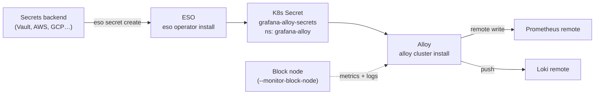

# Alloy & Secrets Commands

Grafana Alloy ships this cluster's metrics and logs to remote Prometheus and Loki endpoints.
External Secrets Operator (ESO) is how you get the passwords for those endpoints into the
cluster without writing them into a values file.

Both live here because you almost always set them up together.

## How the pieces fit



You can create the Secret by hand with `kubectl` instead of using ESO. Alloy does not care
where it came from.

---

# Alloy

## Prerequisites

Needed only when you configure remotes (`--add-prometheus-remote` / `--add-loki-remote`):

| Prerequisite | Detail |
|---|---|
| A running Kubernetes cluster | From `block node install` or `kube cluster install`. Alloy deploys into an existing cluster; it never creates one |
| The `grafana-alloy-secrets` Secret | In the `grafana-alloy` namespace, with a password key per remote |
| Reachable remote endpoints | The Prometheus/Loki URLs must be reachable from inside the cluster |
| A block node (optional) | Only if you pass `--monitor-block-node` |

> **Without any remote flags, Alloy installs with no remotes and needs no Secret.** That is a
> valid way to start.

## `alloy cluster install`

```bash
# Step 1 — create the Secret with a password per remote
kubectl create namespace grafana-alloy
kubectl create secret generic grafana-alloy-secrets \
  --namespace=grafana-alloy \
  --from-literal=PROMETHEUS_PASSWORD_PRIMARY=<password> \
  --from-literal=LOKI_PASSWORD_PRIMARY=<password>

# Step 2 — install Alloy with remotes
sudo solo-provisioner alloy cluster install \
  --cluster-name=mainnet-block-01 \
  --profile=mainnet \
  --add-prometheus-remote=name=primary,url=https://prom1.example.com/api/v1/write,username=user1 \
  --add-loki-remote=name=primary,url=https://loki1.example.com/loki/api/v1/push,username=user1 \
  --monitor-block-node

# Or: install with no remotes at all (no Secret needed)
sudo solo-provisioner alloy cluster install --cluster-name=mainnet-block-01
```

| Flag | What it does |
|---|---|
| `--cluster-name` | Cluster name used as a label on every metric and log stream |
| `--profile`, `-p` | Deployment profile. Sets the `environment` label for the `ops` label profile. Optional — falls back to `--config` |
| `--monitor-block-node` | Turn on block-node-specific monitoring |
| `--add-prometheus-remote` | Add a Prometheus remote. Repeatable. See [remote format](#remote-format) |
| `--add-loki-remote` | Add a Loki remote. Repeatable |
| `--stop-on-error` | Stop at the first failing step (default) |
| `--rollback-on-error` | Undo completed steps on failure |
| `--continue-on-error` | Keep going past failures |

### Deprecated flags

| Deprecated | Use instead |
|---|---|
| `--prometheus-url`, `--prometheus-username` | `--add-prometheus-remote` |
| `--loki-url`, `--loki-username` | `--add-loki-remote` |

The three error-handling flags are mutually exclusive and apply to both `alloy cluster
install` and `alloy cluster uninstall`. See [Global flags](../reference/global-flags.md#error-handling-flags).

## Remote format

```
name=<name>,url=<url>,username=<username>[,labelProfile=eng|ops]
```

| Key | Meaning |
|---|---|
| `name` | Unique identifier for the remote: `primary`, `backup`, `grafana-cloud` |
| `url` | Remote write / push endpoint |
| `username` | Auth username. The **password comes from the K8s Secret**, never the flag |
| `labelProfile` | Optional. `eng` (default) or `ops`. See [Label profiles](#label-profiles) |

### Secret key naming

Each remote needs a matching password key, named from the remote type and name:

- Prometheus: `PROMETHEUS_PASSWORD_<REMOTE_NAME>`
- Loki: `LOKI_PASSWORD_<REMOTE_NAME>`

So a cluster with `primary` and `backup` remotes needs four keys:

```bash
kubectl create namespace grafana-alloy
kubectl create secret generic grafana-alloy-secrets \
  --namespace=grafana-alloy \
  --from-literal=PROMETHEUS_PASSWORD_PRIMARY=<password> \
  --from-literal=PROMETHEUS_PASSWORD_BACKUP=<password> \
  --from-literal=LOKI_PASSWORD_PRIMARY=<password> \
  --from-literal=LOKI_PASSWORD_BACKUP=<password>
```

## Changing remotes

`alloy cluster install` is **declarative**. Every run replaces the entire remote
configuration with what you pass. There is no add/remove verb.

**Always list every remote you want to keep.**

| To do this | Do this |
|---|---|
| Add a remote | Re-run with all existing remotes **plus** the new one |
| Remove a remote | Re-run and simply omit it |
| Change a URL | Re-run with the same `name` and the new `url` |
| Remove all remotes | Re-run with no remote flags |

```bash
# You had 'primary'; you want 'primary' and 'backup'
sudo solo-provisioner alloy cluster install \
  --cluster-name=mainnet-block-01 \
  --add-prometheus-remote=name=primary,url=https://prom1.example.com/api/v1/write,username=user1 \
  --add-prometheus-remote=name=backup,url=https://prom2.example.com/api/v1/write,username=user2 \
  --add-loki-remote=name=primary,url=https://loki1.example.com/loki/api/v1/push,username=user1

# Now drop 'backup' again — just leave it out
sudo solo-provisioner alloy cluster install \
  --cluster-name=mainnet-block-01 \
  --add-prometheus-remote=name=primary,url=https://prom1.example.com/api/v1/write,username=user1 \
  --add-loki-remote=name=primary,url=https://loki1.example.com/loki/api/v1/push,username=user1
```

## Label profiles

A label profile auto-injects extra labels into every metric and log stream. Set it per remote
with the optional `labelProfile` key.

| Profile | Labels added |
|---|---|
| `eng` *(default)* | `cluster` |
| `ops` | `cluster`, `environment`, `instance`, `instance_type`, `inventory_name`, `ip` (when available) |

```bash
sudo solo-provisioner alloy cluster install \
  --cluster-name=lfh02-previewnet-blocknode \
  --profile=previewnet \
  --add-prometheus-remote=name=primary,url=https://prom.example.com/api/v1/write,username=user1,labelProfile=ops \
  --add-loki-remote=name=primary,url=https://loki.example.com/loki/api/v1/push,username=user1,labelProfile=ops \
  --monitor-block-node
```

With `--cluster-name=lfh02-previewnet-blocknode` and `--profile=previewnet`, `ops` derives:

| Label | Value | Where it comes from |
|---|---|---|
| `cluster` | `lfh02-previewnet-blocknode` | `--cluster-name`. Always set |
| `environment` | `previewnet` | `--profile` |
| `instance` | `lfh02-previewnet-blocknode` | Full cluster name. Overrides the auto-scraped `IP:port` |
| `instance_type` | `lfh` | Alphabetic prefix of the first segment of the cluster name |
| `inventory_name` | `lfh02-previewnet-blocknode` | Full cluster name |
| `ip` | `<ip>` | Optional. Set when an IP label is available for the node |

Each remote carries its own `labelProfile`. Omitting it means `eng`.

More detail: [`docs/dev/label_profiles.md`](../dev/label_profiles.md).

## `alloy cluster uninstall`

```bash
sudo solo-provisioner alloy cluster uninstall
```

---

# External Secrets Operator (ESO)

ESO syncs secrets from an external store into Kubernetes. Install it once per cluster, then
declare an `ExternalSecret` per secret you need — including `grafana-alloy-secrets`.

## Prerequisites

| Prerequisite | Detail |
|---|---|
| Root privileges | The install command needs `sudo` |
| A reachable cluster | Via the admin kubeconfig |

## `eso operator install`

Installs the `external-secrets/external-secrets` Helm chart. The chart version is pinned by
the infrastructure catalog. Idempotent: if ESO is already in the target namespace, the install
is skipped with a clear message.

```bash
# Default namespace: external-secrets
sudo solo-provisioner eso operator install

# Custom namespace
sudo solo-provisioner eso operator install --namespace my-eso
```

| Flag | What it does | Default |
|---|---|---|
| `--namespace` | Namespace for the operator | `external-secrets` |

## `eso operator uninstall`

```bash
sudo solo-provisioner eso operator uninstall
sudo solo-provisioner eso operator uninstall --namespace my-eso
```

| Flag | What it does | Default |
|---|---|---|
| `--namespace` | Namespace to uninstall from | `external-secrets` |

> **This deletes secrets across the whole cluster.** Uninstalling ESO removes its
> cluster-scoped CRDs, which deletes every `ExternalSecret` and `SecretStore` in the cluster —
> and the Kubernetes Secrets they sync. Do not run it while anything still depends on a synced
> secret.

Idempotent: if ESO is not installed in the target namespace, the uninstall is skipped.

## `eso secret create`

Creates or updates an `ExternalSecret`, which ESO reconciles into a Kubernetes Secret. It uses
server-side apply, so re-running with the same `--name`/`--namespace` updates in place.

```bash
sudo solo-provisioner eso secret create \
  --store=vault-store \
  --name=grafana-alloy-secrets \
  --namespace=grafana-alloy \
  --set PROMETHEUS_PASSWORD_PRIMARY=secret/data/grafana/alloy/prod/prometheus/primary#password \
  --set LOKI_PASSWORD_PRIMARY=secret/data/grafana/alloy/prod/loki/primary#password
```

| Flag | What it does | Default |
|---|---|---|
| `--store` | **Required.** Name of the `ClusterSecretStore` to sync from | — |
| `--name` | **Required.** Name of the resulting Secret (and the ExternalSecret) | — |
| `--namespace` | **Required.** Namespace for both | — |
| `--set` | **At least one required.** Map a Secret key to a store path: `KEY=store/path[#field]`. Repeatable | — |
| `--refresh-interval` | How often ESO re-syncs from the store | `1h` |

> **The `ClusterSecretStore` named by `--store` and the target `--namespace` must already
> exist.** The store points at your secrets backend (Vault, AWS, GCP, …). Setting it up is
> cluster-operator configuration and is out of scope for this command.

---

## See also

- [Block node commands](block-node.md) — what `--monitor-block-node` monitors
- [Configuration](../reference/configuration.md) — the `alloy:` config-file section
- [Troubleshooting](../troubleshooting.md)
