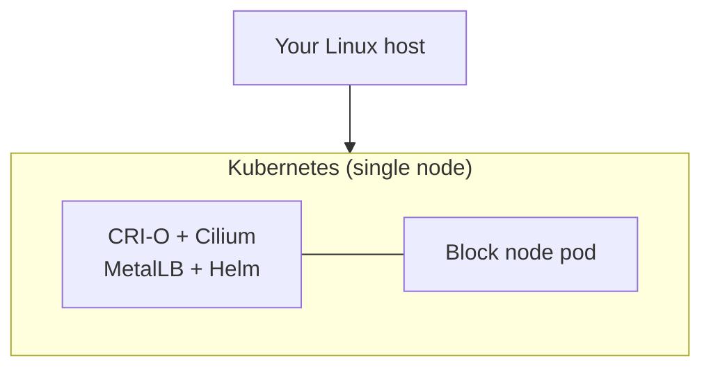
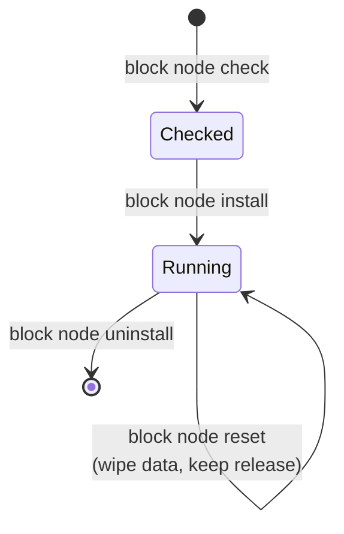
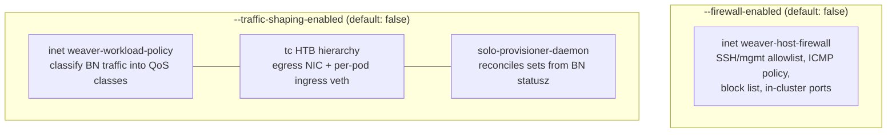

# Block Node Commands

Everything under `solo-provisioner block node …`. These commands install and run a Hedera
Block Node, including the Kubernetes cluster underneath it.

All of them need `sudo`.

> **Flags not listed on this page.** Every command here also accepts the
> [global flags](../reference/global-flags.md) — `--config`, `--output`, `--log-level`,
> `--force`, `--verbose`, `--non-interactive`.
>
> **`--profile`** is a persistent flag on `block`, so every subcommand below takes it. It
> selects the target network and with it the hardware floor and sizing defaults — see
> [Deployment profiles](../reference/deployment-profiles.md).

## What you will end up with `block node install`



One command — `block node install` — builds all of it.

## Lifecycle



| Command | Chart version | Helm values | Data on disk | Turns features on/off |
|---|---|---|---|---|
| `check` | — | — | — | no (read-only) |
| `install` | you pick | you pick | created | yes |
| `upgrade` | **changes** | you pick | kept (unless `--with-reset`) | no |
| `reconfigure` | unchanged | you pick | kept (unless `--with-reset`) | yes |
| `reset` | unchanged | unchanged | **wiped** | no |
| `uninstall` | release removed | — | kept unless you ask | no |

The short version of the difference between the three middle rows:

- **Changing the chart version?** `upgrade`.
- **Changing settings on the same version?** `reconfigure`.
- **Just need empty storage?** `reset`.

---

## `check` — is this machine ready?

Read-only preflight. Run it before `install` to find problems early.

```bash
# Basic check
sudo solo-provisioner block node check --profile=mainnet

# Size the check for a specific plugin preset
sudo solo-provisioner block node check --profile=mainnet --plugin-preset=tier1-lfh

# Size it for an explicit plugin list
sudo solo-provisioner block node check --profile=mainnet \
  --plugins=com.hedera.block.suites.BlockStreamPublishing,com.hedera.block.suites.LocalFileSystemRecorder
```

It checks:

- CPU, memory and disk against the profile's hardware floor
- Required dependencies
- Network connectivity
- Storage availability

| Flag | What it does | Default |
|---|---|---|
| `--plugin-preset` | Preset to size hardware for: `tier1-lfh`, `tier1-rfh`, `custom` | `""` |
| `--plugins` | Comma-separated plugin list. Overrides `--plugin-preset` | `""` |

---

## `install` — deploy a block node

Installs the Kubernetes cluster (if it is not there yet) and the block node on top of it.

```bash
# Smallest useful invocation
sudo solo-provisioner block node install --profile=local

# Production, with a config file and custom Helm values
sudo solo-provisioner block node install \
  --profile=mainnet \
  --config=/etc/solo-provisioner/config.yaml \
  --values=/etc/solo-provisioner/block-node-values.yaml

# Custom storage layout
sudo solo-provisioner block node install \
  --profile=mainnet \
  --base-path=/mnt/nvme \
  --live-size=50Gi \
  --archive-size=500Gi \
  --log-size=10Gi \
  --application-state-size=500Mi

# Pin the chart version and namespace
sudo solo-provisioner block node install \
  --profile=testnet \
  --chart-version=0.22.1 \
  --namespace=hedera-block
```

### Helm flags

| Flag | What it does |
|---|---|
| `--values`, `-f` | Custom Helm values file |
| `--chart-repo` | Helm chart repository URL |
| `--chart-version` | Pin a specific chart version |
| `--namespace` | Kubernetes namespace |
| `--release-name` | Helm release name |
| `--timeout` | Budget for the Helm install/upgrade as a Go duration (`10m`, `600s`, `1h`). Exceeding it rolls the operation back (`--atomic`). Default `5m0s` |

### Storage flags

Set `--base-path` and the rest default under it, or set each path yourself.

| Storage | Path flag | Size flag | Available on |
|---|---|---|---|
| Live | `--live-path` | `--live-size` | all chart versions |
| Archive | `--archive-path` | `--archive-size` | all chart versions |
| Log | `--log-path` | `--log-size` | all chart versions |
| Verification | `--verification-path` | `--verification-size` | chart **< 0.37.0** |
| Application state | `--application-state-path` | `--application-state-size` | chart **>= 0.37.0** |
| Plugins | `--plugins-path` | `--plugins-size` | chart **>= 0.28.1** |

`--base-path` sets the parent directory for all of the above.

> **Verification and application state swap at chart 0.37.0.** Verification retires and
> application-state appears in the same cutover
> ([hiero-block-node#3025](https://github.com/hiero-ledger/hiero-block-node/pull/3025)).
> Passing the flag for the storage that is not active on your chart version is silently
> ignored, so it is safe to pass both.

### Plugin flags

| Flag | What it does |
|---|---|
| `--plugin-preset` | `tier1-lfh`, `tier1-rfh`, `custom`, or `none` to leave the chart default alone. Prompts if you omit it |
| `--plugins` | Comma-separated plugin list. Overrides `--plugin-preset` |
| `--plugins-size` | PV/PVC size for plugin storage (`5Gi`, `10Gi`) |
| `--plugins-path` | Path for plugin storage |

### Retention flags

| Flag | What it does | Default |
|---|---|---|
| `--historic-retention` | Historic block retention threshold. `0` means unlimited | `0` |
| `--recent-retention` | Recent block retention threshold | `96000` |

### Service exposure

| Flag | What it does | Default |
|---|---|---|
| `--load-balancer-enabled` | Add the MetalLB address-pool annotation to the block node service. Set `false` where there is no MetalLB | `true` |

See [Block-node service exposure](../block-node-service-exposure.md) for how this interacts
with `service.type` and the chart's split topology.

---

## Networking: two independent switches

`block node install` can also set up the host's network state. There are **two separate
opt-in switches**, and neither is on by default:



- The two switches are **independent**. Turning one on says nothing about the other.
- Both decisions are **durable**: they are recorded in runtime state, and later `upgrade` and
  `reconfigure` runs honour them.
- `upgrade` never changes either one. To flip a switch after install, use
  [`reconfigure`](#reconfigure--change-settings-without-changing-the-version).

### Host firewall (`--firewall-enabled`)

Lays down the `inet weaver-host-firewall` nftables table — the host's own SSH/management
allowlist, ICMP policy, operator block list, and in-cluster host-service ports.

| Flag | What it does | Default |
|---|---|---|
| `--firewall-enabled` | Turn the host firewall on | `false` |
| `--mgmt-cidrs` | SSH/management allowlist CIDRs. **Empty skips the firewall entirely** | none |
| `--blocked-cidrs` | Operator block list, CIDRs and/or domain names. Dropped inbound, outbound and forwarded — including established connections | none |
| `--mgmt-ports` | Management TCP port(s). Comma-separated or repeated | `22` |
| `--pod-cidr` | Pod CIDR for the in-cluster host-service ports rule | auto-detected |
| `--in-cluster-ports` | In-cluster host-service ports | `6443,4244,7472,10250` |

Worth knowing:

- **An empty `--mgmt-cidrs` skips the firewall.** That is deliberate — a default-drop policy
  with an empty allowlist would lock you out of SSH.
- **`--blocked-cidrs` needs `--firewall-enabled`.** Both live on the same table, rendered by
  the same step.
- **`--blocked-cidrs` is not `bn-restricted`.** The block list is a plain deny list, dropped
  before every other rule, and is yours for its whole lifetime. `bn-restricted` lives on the
  workload plane and is managed automatically by the daemon.
- **A domain name in the block list must resolve.** `--mgmt-cidrs` and `--blocked-cidrs` both
  take names, but an unresolvable one is refused on every path in the block list rather than
  warned about — losing an entry there stops denying a host instead of stopping admitting one.
  See [Domain names in address lists](network/firewall.md#domain-names-in-address-lists).

Full command surface: [Network commands](network/) — [firewall](network/firewall.md), [policy](network/policy.md), [shape](network/shape.md).

### Traffic shaping (`--traffic-shaping-enabled`)

One switch creates all three parts — workload policy plane, tc HTB shaping, and the daemon.
There is no separate daemon prompt or flag.

| Flag | What it does | Default |
|---|---|---|
| `--traffic-shaping-enabled` | Turn on the policy plane + tc shaping + daemon | `false` |
| `--egress-interface` | Physical NIC for the egress HTB hierarchy (`eth0`). Auto-detected from the default route | auto |
| `--link-rate` | NIC line rate (`1gbit`, `100mbit`), or `auto` to detect and store the link speed at install time | auto-detect at each boot |
| `--shape` | Per-class override, repeatable: `--shape <class>=rate=<r>,ceil=<c>,prio=<p>` | profile defaults |

```bash
sudo solo-provisioner block node install \
  --profile=mainnet \
  --traffic-shaping-enabled \
  --egress-interface=eth0 \
  --link-rate=1gbit \
  --shape publisher=rate=800mbit,ceil=1gbit,prio=0
```

What install sets up for you:

- **Seven BN policies**, created idempotently on the `inet weaver-workload-policy` plane:
  `bn-publisher`, `bn-subscriber-in`, `bn-partner-out`, `bn-public-out`, `bn-health`,
  `bn-restricted`, `bn-backfill`. The rendered `.nft` is persisted for boot replay.
- **Both tc shapes** — the egress NIC hierarchy and the per-pod ingress hierarchy — using the
  default per-class budgets, so the daemon can attach ingress shaping on the next pod create
  with no manual step. Ingress bandwidth defaults to the egress `--link-rate`.
- **The daemon**, installed and provisioned for this namespace. If it is already running,
  this is a no-op.

Two details that surprise people:

- **No set starts with members.** Every set's membership, `bn-restricted` included, is
  reconciled at runtime by the daemon from the block node's statusz. There is no install-time
  flag to seed one.
- **`bn-health` is not a classifier.** It drops the block node's health/statusz port on the
  forward path from every source. The kubelet and the provisioner both reach the pod without
  crossing that hook, so nothing needs allowlisting and the port is unreachable from off-node.

Re-running install never clobbers set membership you applied by hand or per-class shape
values you tuned. `--force` re-renders the static rules.

Class budgets and the `network shape` commands: [`network shape`](network/shape.md).

### Daemon flags

| Flag | What it does | Default |
|---|---|---|
| `--daemon-bin` | Path to a pre-built `solo-provisioner-daemon` to install as-is. Highest precedence | none |
| `--daemon-version` | Version to download when the daemon is installed. Ignored if `--daemon-bin` is set | this CLI's version |
| `--statusz-base-url` | Explicit `http(s)` base URL for the BN statusz endpoint, e.g. for a port-forward | discovered from the pod |
| `--statusz-poll-interval` | How often the monitor polls statusz, as a Go duration (`5s`, `30s`) | `5s` |

The daemon binary is resolved in this order:

1. `--daemon-bin`
2. `SOLO_PROVISIONER_DAEMON_BIN`
3. A daemon already installed in the weaver bin directory
4. Download from the infrastructure catalog at `--daemon-version`

If every source comes up empty, the command fails with a hint listing the ways to supply a
binary. It never prompts for a path.

> **Locally-built CLIs** carry version `0.0.0`, which has no release to download. That is
> fine: `sudo solo-provisioner install` copies the co-built daemon from the same `bin/`
> directory, so `task build` followed by a self-install leaves a matching daemon in place.

### Both planes are dual-stack

- v4 and v6 sets are always rendered on both `inet weaver-host-firewall` and
  `inet weaver-workload-policy`.
- `--mgmt-cidrs`, `--blocked-cidrs`, `--pod-cidr` and `network policy --cidrs` accept mixed
  IPv4/IPv6 lists. Each entry is routed to the matching family's set.
- The host firewall's default-drop input chain admits the ICMPv6 traffic IPv6 cannot live
  without: Neighbor Discovery (NS/NA/RS/RA, hop-limit-255 guarded), MLD, and `packet-too-big`
  (the IPv6 PMTUD signal).
- **Auto-detection only finds the v4 pod CIDR.** For IPv6 workload classification, pass the v6
  pod CIDR explicitly.

---

## `upgrade` — move to a new chart version

```bash
# New values file
sudo solo-provisioner block node upgrade --profile=mainnet --values=/path/to/new-values.yaml

# New chart version
sudo solo-provisioner block node upgrade --profile=mainnet --chart-version=0.23.0

# New values, ignoring whatever the previous release had
sudo solo-provisioner block node upgrade --profile=mainnet \
  --values=/path/to/values.yaml --no-reuse-values

# Upgrade and wipe storage in one go
sudo solo-provisioner block node upgrade --profile=mainnet \
  --chart-version=0.24.0 --with-reset
```

| Flag | What it does | Default |
|---|---|---|
| `--no-reuse-values` | Do not reuse the previous release's values | `false` |
| `--with-reset` | Wipe block node data directories. PVs and PVCs are kept | `false` |
| `--timeout` | Helm operation budget as a Go duration. Rolls back on overrun | `5m0s` |

> **Upgrade never flips a feature switch.** It does not expose `--firewall-enabled` or
> `--traffic-shaping-enabled` and never prompts for them. A version bump is routine, so it
> reads the install decision and re-asserts the matching network state create-if-missing.
> To change what is enabled, use `reconfigure`.

---

## `reconfigure` — change settings without changing the version

Re-applies configuration to a running block node on its current chart version. This is the
only command that can turn the firewall or traffic shaping on or off after install.

```bash
# New values
sudo solo-provisioner block node reconfigure --profile=mainnet --values=/path/to/updated-values.yaml

# Skip the pod rollout-restart
sudo solo-provisioner block node reconfigure --profile=mainnet \
  --values=/path/to/values.yaml --no-restart

# Turn on traffic shaping for a node installed without it
sudo solo-provisioner block node reconfigure --profile=mainnet --traffic-shaping-enabled=true

# Tear down a host firewall that was previously enabled
sudo solo-provisioner block node reconfigure --profile=mainnet --firewall-enabled=false

# Point the daemon at a port-forwarded BN and slow its polling
sudo solo-provisioner block node reconfigure --profile=mainnet \
  --statusz-base-url=http://127.0.0.1:8080 --statusz-poll-interval=10s
```

| Flag | What it does | Default |
|---|---|---|
| `--no-reuse-values` | Do not reuse the previous release's values | `false` |
| `--no-restart` | Skip the rollout-restart of the block node pod | `false` |
| `--with-reset` | Wipe data directories. PVs and PVCs are kept | `false` |
| `--purge-storage` | Delete PVs and PVCs as well as wiping data. Implies `--with-reset` | `false` |
| `--firewall-enabled` | Turn the host firewall on or off. Same sub-flags as `install` | current state |
| `--traffic-shaping-enabled` | Turn the traffic-shaping bundle on or off. Same sub-flags as `install` | persisted state |
| `--statusz-base-url` | Override the statusz endpoint. Omitting it preserves what is on disk | preserved |
| `--statusz-poll-interval` | Change the poll cadence. Omitting it preserves what is on disk | preserved |

### How the two switches are seeded

A reconfigure that does not pass the flag never changes what is enabled.

| Switch | Seeded from |
|---|---|
| `--firewall-enabled` | The firewall's **current on-host state**. A live `inet weaver-host-firewall` table always seeds **enabled**, even one you created by hand with `network firewall create` |
| `--traffic-shaping-enabled` | The **persisted install decision** |

Teardown only happens on an explicit toggle — passing `=false`, or answering **No** to the
prompt for a feature that is currently on:

- Turning the firewall off removes the `inet weaver-host-firewall` table.
- Turning traffic shaping off removes every `bn-*` policy, the tc egress shaping, and the
  daemon's block-node monitor. It does **not** uninstall the shared daemon service, so a
  co-located component (consensus-node monitoring, say) keeps running.
- Turning traffic shaping on activates the daemon, same as `install`.

> **Changing a storage path needs `--purge-storage`.** A local PV's `hostPath.path` is
> immutable, so the PV/PVCs must be deleted and recreated at the new paths. Running
> `reconfigure --with-reset` with a path change is rejected with a clear error.

---

## `reset` — wipe storage, keep the release

```bash
sudo solo-provisioner block node reset --profile=mainnet
```

What happens, in order:

1. Scale the StatefulSet down to 0 replicas.
2. Wait for the pods to terminate.
3. Clear every storage directory — archive, live, log, plus whichever optional storages your
   chart version has (verification below 0.37.0, application-state from 0.37.0, plugins from
   0.28.1).
4. Scale back up to 1 replica.
5. Wait for the pod to become ready.

> **This deletes all block data.** There is no undo. Think twice on `mainnet`.

To reset and change version at the same time, use `upgrade --with-reset` instead.

---

## `uninstall` — remove the block node

Three variants, depending on what you want to keep:

| Command | Helm release | Data on disk | PV/PVC objects |
|---|---|---|---|
| `block node uninstall` | removed | kept | kept |
| `block node uninstall --with-reset` | removed | **wiped** | kept |
| `block node uninstall --purge-storage` | removed | **wiped** | **deleted** |

```bash
# Keep everything on disk for a future re-install
sudo solo-provisioner block node uninstall --profile=mainnet

# Start fresh on disk, keep the PV/PVC topology
sudo solo-provisioner block node uninstall --profile=mainnet --with-reset

# Full cleanup
sudo solo-provisioner block node uninstall --profile=mainnet --purge-storage
```

Which one to pick:

- **Re-installing against the same data?** Plain `uninstall`.
- **Want a clean disk but the same PV layout?** `--with-reset`.
- **Done with this node?** `--purge-storage`. This is the only targeted way to remove the
  block-node PVs without tearing down the whole cluster with `kube cluster uninstall`.

---

## `reconcile-shaper` — sync policy sets from statusz

Reads the block node's statusz endpoints and rewrites the workload policy sets whose
membership changed. The daemon runs this for you; run it by hand to debug.

```bash
# Dry run — print the desired membership, touch nothing. No privilege needed.
solo-provisioner block node reconcile-shaper --statusz-url=http://10.0.0.5:8080 --check

# Apply — read live nft, diff, rewrite what changed. Needs root.
sudo solo-provisioner block node reconcile-shaper --statusz-url=http://10.0.0.5:8080

# Machine-readable
sudo solo-provisioner block node reconcile-shaper --statusz-url=http://10.0.0.5:8080 --output=json
```

| Flag | What it does | Default |
|---|---|---|
| `--statusz-url` | Base URL of the block node's statusz endpoints. **Required** | — |
| `--check` | Print the desired-membership digest only. Reads and writes no nft state | `false` |

### What it reconciles

Two different things, from two different parts of statusz:

**Set membership** — which addresses are in a policy's `@<name>` set:

| statusz direction + category | Policy set | Key |
|---|---|---|
| inbound publisher | `bn-publisher` | address |
| inbound partner | `bn-partner-out` | address |
| inbound restricted | `bn-restricted` | address |
| outbound partner | `bn-backfill` | compound `address . port` |

**Listener ports** — which ports feed a policy's `<name>_ports` match:

| statusz category | Ports set(s) |
|---|---|
| publisher | `bn-publisher` |
| partner | `bn-partner-out` |
| public | `bn-subscriber-in`, `bn-public-out` |

Not touched by the reconciler: the public category has no membership binding (its policies
match any source), and `bn-health` has no binding at all — its match key is a static port
list, not membership.

> **Privilege:** `--check` needs none. The apply path reads and writes live
> `inet weaver-workload-policy` sets and must run as root. The daemon invokes it via sudo.

---

## `tc-attach` — attach ingress shaping to a pod veth

Installs the ingress HTB hierarchy (classes `1:10` / `1:20` / `1:30`, default
`reserve-ingress`, `fq_codel` leaves, no tc filters) on a block node pod's host-side veth,
using the per-class ingress budgets recorded by `network shape`.

The daemon's pod-lifecycle watcher runs this on every block node pod create, passing the veth
it resolved. Run it by hand only to debug.

```bash
# Attach
sudo solo-provisioner block node tc-attach --veth lxc1a2b3c

# Detach (best-effort; the kernel also removes it when the pod's veth disappears)
sudo solo-provisioner block node tc-attach --veth lxc1a2b3c --detach
```

| Flag | What it does | Default |
|---|---|---|
| `--veth` | Host-side veth interface, e.g. `lxc1a2b3c`. **Required** | — |
| `--detach` | Tear the hierarchy down instead of installing it | `false` |

> **Privilege:** always root — it mutates live kernel tc state. Unlike `reconcile-shaper`
> there is no unprivileged `--check` mode. It needs the ingress shape to have been recorded
> first, which `block node install` does via `network shape`.

Find a pod's veth with `ip link` or `tc qdisc show`.

---

## See also

- [Network commands](network/) — the firewall, policy and shape commands in full
- [Daemon service](README.md#daemon-service) — installing and checking the daemon
- [Workflows](../workflows.md) — end-to-end deploy, upgrade and teardown recipes
- [Traffic shaper internals](../dev/traffic-shaper.md) — design notes for developers
