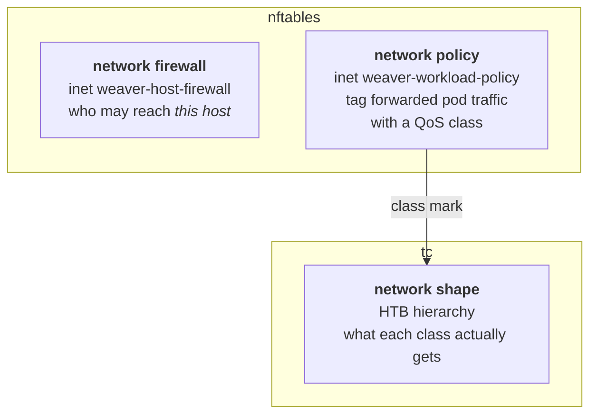

# Network Commands

`solo-provisioner network …` manages the node's network state: the host's own firewall, the
workload traffic classification plane, and the tc bandwidth hierarchy.

Most operators never run these directly — [`block node install`](block-node.md#networking-two-independent-switches)
sets all three up. Use them to inspect, adjust, or repair what it created.

## The three planes



| I want to… | Scope |
|---|---|
| Control who can SSH to the host, or block an address outright | [`network firewall`](#network-firewall--the-host-firewall) |
| Decide which QoS class a workload's traffic lands in | [`network policy`](#network-policy--workload-traffic-classification) |
| Decide how much bandwidth each class gets | [`network shape`](#network-shape--bandwidth-classes) |

The firewall is node-agnostic — it applies to every node type (block, consensus, mirror,
relay). The policy plane is workload-specific, and today the block node is its only caller.

---

# `network firewall` — the host firewall

Manages the `inet weaver-host-firewall` table: the host's management allowlist, ICMP policy,
in-cluster host-service ports, and any number of named allow rules.

## Two kinds of record

**Three reserved blocks.** Weaver derives or defaults their content, and leaving one out is
dangerous, so they are first-class and cannot be deleted.

| Block | What it holds |
|---|---|
| `mgmt` | Management/SSH allowlist |
| `blocked` | Operator block list — dropped on `prerouting`, `input` and `output` |
| `in_cluster` | Host-service ports reachable from the pod CIDR |

**Named allow rules.** One source list x port list x protocol accept, for anything else the
host must admit — Kubernetes control-plane ports, Cilium VXLAN, an admin jump host.

Structure (which rules exist, what protocol each matches) is declared with
`create-allow-rule`, or stated for the whole table at once with `create --from-file`.
Membership (the addresses and ports inside a rule) is always editable from the CLI.

## Files on disk

| Path | Contents |
|---|---|
| `/etc/solo-provisioner/network-weaver-host-firewall.yaml` | The config currently applied |
| `/etc/solo-provisioner/network-weaver-host-firewall.yaml.prev` | The generation before it |
| `/etc/solo-provisioner/network-weaver-host-firewall.nft` | The rendered ruleset replayed at boot |

Every mutation applies to the live kernel in one atomic `nft -f` transaction and rewrites both
the `.nft` and the `.yaml` it was rendered from.

## `create` — lay down the table

Create-if-missing: an existing table is left alone unless you pass `--force`.

```bash
# Create with a management allowlist and the default in-cluster ports
sudo solo-provisioner network firewall create \
  --mgmt-cidrs 10.0.0.0/8 \
  --ssh-port 22 \
  --pod-cidr 10.4.0.0/24 \
  --in-cluster-ports 6443,4244,10250

# Re-render an existing table from new flags
sudo solo-provisioner network firewall create --mgmt-cidrs 10.0.0.0/8,192.168.0.0/16 --force
```

| Flag | What it does | Default |
|---|---|---|
| `--mgmt-cidrs` | Management/SSH allowlist CIDRs. Comma-separated or repeated | none |
| `--blocked-cidrs` | Block list CIDRs, dropped before any other rule | none |
| `--in-cluster-ports` | Host-service ports reachable from the pod CIDR | `6443,4244,7472,10250` |
| `--ssh-port` | Management TCP port. Shorthand for a one-element `mgmt.ports` | `22` |
| `--pod-cidr` | Pod CIDR allowed to reach the in-cluster ports | auto-detected |
| `--from-file` | Render the whole table from a YAML config. Mutually exclusive with the flags above | none |
| `--force` | Re-render even if the table exists (global flag, `-y`) | `false` |

> **Omitting `--mgmt-cidrs` leaves the management rule with an empty source set under a
> default-drop policy.** That locks you out of new SSH connections. Always pass it.

**Pod CIDR auto-detection.** With `--pod-cidr` omitted, weaver reads the local node's
`.spec.podCIDR` from the Kubernetes API, matching by hostname (or taking the sole node on a
single-node host). `network firewall create` is node-agnostic and may run before a cluster
exists, so detection is best-effort: with no cluster reachable it logs a warning and **omits
the in-cluster-ports rule**. Pass `--pod-cidr` explicitly to render it anyway.

**ICMP is fixed, and there are no ICMP flags.** The ruleset is:

- Full ICMP from the management allowlist.
- From everyone else, the path-health subset: `destination-unreachable` (Path MTU Discovery)
  and `time-exceeded` (traceroute) always accepted, `echo-request` (ping) rate-limited to
  10/second.

Dropping ICMP errors would silently break PMTUD for legitimate clients, so it is not an
option. The one configurable part is `icmp_echo` on an allow rule, which grants that rule's
sources unmetered `echo-request`.

> There is no `--service-ports`. Block node ports live only in `network policy --ports`. That
> traffic is forwarded rather than delivered locally, so an `input` rule would never match it.

## `create-allow-rule` — declare a named rule

`create-allow-rule` declares the rule; `add` fills it in. Both lists take comma-separated
values, so one `add` finishes the rule in a single atomic apply.

```bash
sudo solo-provisioner network firewall create-allow-rule --name rudder_server --proto tcp --icmp-echo
sudo solo-provisioner network firewall add --name rudder_server \
  --cidr 200.201.203.205/32,10.1.0.0/16 --port 5309,8443,9000-9100

# Deletion needs no separate verb
sudo solo-provisioner network firewall delete --name rudder_server
```

| Flag | What it does | Default |
|---|---|---|
| `--name` | Rule name. May not be `mgmt`, `blocked` or `in_cluster` | required |
| `--proto` | L4 protocol the rule's ports match: `tcp` or `udp` | `tcp` |
| `--icmp-echo` | Grant this rule's sources unmetered ICMP echo-request, above the rate meter | `false` |
| `--force` | Replace an existing rule, **resetting all of it** (global flag, `-y`) | `false` |

Why declaring is a separate verb from `add`:

- **A typo edits nothing.** An unknown `--name` on `add`/`remove`/`set` keeps failing, rather
  than quietly creating a second rule beside the one you meant.
- **Nothing opens early.** A declared rule renders nothing until it has at least one CIDR and
  either a port or `--icmp-echo`, so splitting declare and populate never opens access
  halfway. An incomplete rule is reported as a warning on every apply.
- **Re-declaring is safe.** Without `--force` it warns and changes nothing, mirroring
  `network firewall create`.

> `--force` **replaces** the rule outright. `create-allow-rule --name x --force` on its own
> resets `proto` and `icmp_echo` and empties the address and port lists. To change one field
> of a populated rule, use `set`.

`--proto` and `--icmp-echo` are also settable on `set`, so a rule's protocol can be corrected
without deleting and re-declaring it. The reserved blocks reject both — they render a fixed
shape.

## `create --from-file` — declare the whole table

```yaml
version: 1

mgmt:                                          # required
  cidrs: ["192.168.68.0/24"]                   # required
  ports: ["22"]                                # omitted -> 22

blocked:                                       # required
  cidrs: []                                    # required; [] means block nobody

in_cluster:                                    # required
  cidrs: ["10.4.0.0/14"]                       # omitted -> auto-detected; [] -> no rule
  ports: ["6443", "4244", "7472", "10250"]     # omitted -> the defaults

allow:
  - name: k8s-node
    cidrs: ["10.0.0.0/24"]
    ports: ["6443", "2379-2380", "10250", "10256-10259"]
    proto: tcp

  - name: cilium-vxlan
    cidrs: ["10.0.0.0/24"]
    ports: ["8472"]
    proto: udp

  - name: admin
    cidrs: ["203.0.113.5/32", "2001:db8:5e5::/64"]
    ports: ["22"]
    icmp_echo: true
```

```bash
sudo solo-provisioner network firewall create --from-file rules.yaml --force
```

### Allow-rule fields

| Field | Required | Notes |
|---|---|---|
| `name` | yes | Also the nft set name. `mgmt`, `blocked`, `in_cluster` are reserved |
| `cidrs` | yes | IPv4 and IPv6 in one list; each entry routes to `@<name>` or `@<name>6` by family |
| `ports` | yes\* | Single ports and inclusive ranges (`2379-2380`). \*Optional when `icmp_echo` is set |
| `proto` | no | `tcp` (default) or `udp`. nft has no combined match, so a service on both is two rules |
| `icmp_echo` | no | Unmetered `echo-request`, rendered above the rate meter |

### Top-level keys

| Key | Required | Omitted means |
|---|---|---|
| `version` | no | The current schema version (`1`) |
| `mgmt` | **yes** | rejected |
| `blocked` | **yes** | rejected |
| `in_cluster` | **yes** | rejected |
| `mgmt.cidrs` | **yes** | rejected — no safe default exists |
| `mgmt.ports` | no | `22` |
| `blocked.cidrs` | **yes** | rejected — write `[]` to block nobody |
| `in_cluster.cidrs` | no | auto-detect this node's pod CIDR (`[]` renders no rule) |
| `in_cluster.ports` | no | `6443,4244,7472,10250` |
| `allow` | no | no named allow rules — **and any that exist are deleted** |

### The file is the whole table

Nothing is inherited from the host's current firewall. Only `add`/`remove`/`set` merge with
what is already there. Two consequences:

- **`allow:` is declarative.** A rule absent from the file is **deleted**.
- **All three reserved blocks are required**, as is `cidrs` inside `mgmt` and `blocked`. An
  omitted block would fall back to a default the file never stated — and for `mgmt` that
  default is an empty allowlist under default-drop, a lockout nobody wrote down. To render no
  rule for a block, state it with an empty list (`in_cluster: {cidrs: []}`). The block itself
  still cannot be removed.

`in_cluster.cidrs` is the one address list weaver can legitimately derive on its own, which is
why it stays optional. Its absence costs a rule, not access to the host.

The same strictness applies to the persisted config: a truncated or hand-edited
`network-weaver-host-firewall.yaml` is refused rather than loaded with a defaulted management
allowlist. To repair one, see [Recovering a corrupt config](#recovering-a-corrupt-config).

## `add` / `remove` / `set` — change a rule's addresses and ports

- `add` and `remove` **merge** with what is there.
- `set` **replaces** the full list atomically.
- `--name` selects a reserved block or an allow rule.

```bash
sudo solo-provisioner network firewall add    --name mgmt     --cidr 10.1.0.0/16
sudo solo-provisioner network firewall add    --name blocked  --cidr 203.0.113.9/32
sudo solo-provisioner network firewall add    --name k8s-node --cidr 10.0.0.5/32 --port 9345
sudo solo-provisioner network firewall remove --name k8s-node --port 9345
sudo solo-provisioner network firewall set    --name mgmt     --cidrs 10.0.0.0/8,192.168.0.0/16
sudo solo-provisioner network firewall set    --name mgmt     --cidrs-file /etc/mgmt-cidrs.txt

# One invocation is one atomic apply, so a rule can be populated in full at once
sudo solo-provisioner network firewall add --name k8s-node \
  --cidr 10.0.0.5/32,10.0.0.6/32 --port 6443,2379-2380,10250

# --proto and --icmp-echo change what a rule matches, not who is in it
sudo solo-provisioner network firewall set --name cilium-vxlan --proto udp
sudo solo-provisioner network firewall set --name admin --icmp-echo
sudo solo-provisioner network firewall set --name admin --icmp-echo=false
```

| Verb | Flag | What it does |
|---|---|---|
| `add`/`remove`/`set` | `--name` | Rule to modify: `mgmt`, `blocked`, `in_cluster`, or an allow rule |
| `add`/`remove` | `--cidr` | CIDR(s) to add or remove. Comma-separated or repeated |
| `add`/`remove` | `--port` | Port(s) to add or remove. Single ports or ranges |
| `set` | `--cidrs` | Full replacement CIDR list. An empty value clears it |
| `set` | `--cidrs-file` | Same, from a flat file: one per line or comma-separated, `#` comments allowed |
| `set` | `--ports` | Full replacement port list |
| `set` | `--proto` | `tcp` or `udp`. Allow rules only; empty restores `tcp` |
| `set` | `--icmp-echo` | Grant or revoke unmetered ICMP echo-request. Allow rules only |

### Per-block shorthands

The older per-block flags still work — they just name their reserved block implicitly:

```bash
sudo solo-provisioner network firewall add    --mgmt-cidr 10.1.0.0/16      # = --name mgmt --cidr
sudo solo-provisioner network firewall remove --blocked-cidr 203.0.113.9/32
sudo solo-provisioner network firewall add    --in-cluster-port 9100
sudo solo-provisioner network firewall set    --mgmt-cidrs 10.0.0.0/8 --in-cluster-ports 6443,4244
```

### Three behaviours to know

- **`add`/`remove` touch membership only.** To change an allow rule's `--proto` or
  `--icmp-echo` after declaring it, use `set` — `create-allow-rule --force` would reset the
  rest of the rule. The reserved blocks reject both flags outright, **including `--proto tcp`**:
  they render a fixed shape, so accepting the value that happens to match would report a
  change the renderer ignores.
- **Ports are removed by exact spec.** Removing `2379` from a rule holding `2379-2380` does
  nothing — an nft range is a single set element. Replace the range with `set --ports`.
- **Overlapping CIDRs are accepted.** Adding `10.0.0.5/32` to a rule holding `10.0.0.0/24`
  keeps both entries in the config, so removing the wider prefix later leaves the narrower one
  in force. The kernel folds them into one interval, so `show` prints the folded form and
  `show --output yaml` prints what you authored.

> A ruleset the kernel would refuse is rejected before anything is written. The CLI errors and
> both on-disk files are left exactly as they were, so the ruleset that replays at boot is
> always one that loads.

## `show` / `delete`

```bash
# The live table
sudo solo-provisioner network firewall show

# The config it was rendered from
sudo solo-provisioner network firewall show --output yaml

# One rule
sudo solo-provisioner network firewall show --name k8s-node

# Delete one named allow rule
sudo solo-provisioner network firewall delete --name k8s-node

# Remove the whole table and its on-disk artifacts
sudo solo-provisioner network firewall delete --all
```

### `--output yaml` round-trips

It prints exactly the schema `create --from-file` accepts:

```bash
sudo solo-provisioner network firewall show --output yaml > rules.yaml
sudo solo-provisioner network firewall create --from-file rules.yaml --force   # a no-op
```

### `--output commands` copies one rule to another host

Requires `--name`, and works on named allow rules only — the reserved blocks are configured by
`create`/`set`, not declared.

```bash
sudo solo-provisioner network firewall show --name rudder_server --output commands
```

```
solo-provisioner network firewall create-allow-rule --name rudder_server --proto tcp --icmp-echo
solo-provisioner network firewall add --name rudder_server --cidr 200.201.203.205/32 --port 5309,8443
```

Unlike `show --name <rule> --output yaml`, which is an inspection view rather than a config,
this sequence is **safe to replay against a host that already has a firewall**.
`create-allow-rule` and `add` are additive: they bring the one rule into existence and leave
every other rule alone.

```bash
# on the source host
sudo solo-provisioner network firewall show --name rudder_server --output commands > rudder.sh
# on the target host
sudo sh rudder.sh
```

The emitted lines carry no `sudo` of their own, so it is a script you run once with privilege
rather than a list of individually-escalating commands. Addresses come out in stored (sorted)
order — what the host actually has, not the order you typed.

### `delete --all` removes everything

`--all` is the default when `--name` is omitted. It removes the table and both on-disk files,
leaving the host with no weaver-managed firewall — **including no management allowlist**. It
asks for confirmation in an interactive session; `--force` skips the prompt.

It does not disable `solo-provisioner-network-nft.service`, which is shared with the workload
policy plane. Disable that by hand if you need it off.

Reserved blocks cannot be deleted individually. Clear their addresses instead:

```bash
sudo solo-provisioner network firewall set --name mgmt --cidrs ""
```

### `create` and `delete --all` record a decision

Both write the enable decision into the host's runtime state
(`machineState.firewall.disabled`), so `block node reconfigure` agrees with what you did here:

- A firewall you created by hand survives a later reconfigure instead of being torn down.
- One you deleted here is not re-created by it.
- A **live table always wins** over the recorded decision, so removing an active host firewall
  through `block node reconfigure` needs an explicit `--firewall-enabled=false`.
- The membership verbs (`add`, `remove`, `set`) record no decision. `reconfigure` reads their
  result straight out of the persisted YAML, so an urgent `add --name mgmt --cidr …` is not
  reverted by the next reconfigure.

## `reapply` — re-assert the persisted config

Re-renders and re-applies what is on disk without changing it. It takes no arguments — it
states no intent, so there is nothing to supply.

```bash
sudo solo-provisioner network firewall reapply
```

Use it after something else on the host disturbed the table, or after recovering the config.

- It **records no enable/disable decision**, unlike `create` and `delete --all`. A later
  `block node reconfigure` behaves exactly as if the reapply had not run.
- It replaces only the `inet weaver-host-firewall` table. The rendered ruleset scopes its
  flush to that table, so third-party nftables tables are left alone.
- With no config persisted it **fails** rather than applying a default table — default-drop
  with an empty allowlist would lock the host out. Run `create` first.

There is deliberately no way to point `reapply` at a file. To apply a file, that is
`create --from-file <path> --force`.

### Recovering a corrupt config

Every apply retains the generation it replaces, so repair is two steps and **keeps the named
allow rules**:

```bash
sudo cp /etc/solo-provisioner/network-weaver-host-firewall.yaml.prev \
        /etc/solo-provisioner/network-weaver-host-firewall.yaml
sudo solo-provisioner network firewall reapply
```

What that retained copy is and is not:

- **One generation deep.** It is a recovery artifact, not version history. Keep history in
  your own repository, holding the output of `show --output yaml`.
- **Always loadable.** It is only written when the config it replaces parses, so it is never
  itself corrupt. Recovering from it does not consume it — the bad config is not promoted over
  the good one.
- **Not the last line of defence.** Without it, a lost config falls through to re-parsing the
  rendered `.nft`, which recovers the three reserved blocks but **loses every named allow
  rule**. That fallback still exists; the retained copy is what keeps you from needing it.

`delete --all` removes the retained copy along with the config and the `.nft`.

---

# `network policy` — workload traffic classification

Manages the `inet weaver-workload-policy` plane: named per-category rules that either tag
traffic with an HTB priority class, or drop it.

The scope is generic and category-agnostic — the CLI takes CIDRs and class names directly and
knows nothing about statusz. The examples below use the block-node policies because
`block node install` is its only caller today.

## What `create` does

Each `create`:

1. Renders the rule(s) into the `inet weaver-workload-policy` forward chain.
2. Ensures the policy's nft set `@<name>` exists.
3. Writes a per-policy registry file under `/etc/solo-provisioner/policies/`.
4. Applies the full chain to the live kernel with `nft -f`.
5. Atomically rewrites `/etc/solo-provisioner/network-weaver-workload-policy.nft`.

Create-if-missing, mirroring `network firewall create`: an existing policy warns and changes
nothing, even if the flags differ from last time. With `--force` its config and membership are
**replaced** — not merged — from the flags given.

## Pick exactly one action

| Action | Flag | Effect |
|---|---|---|
| Classify | `--stamp <class>` | Tag matching packets with an HTB priority class |
| Drop | `--deny` | Drop matching packets |

There is no `--direction` flag: every class has exactly one direction, so `--stamp` determines
it.

### How `--deny` matching works

- A `--deny` matches its `@<name>` CIDR set, **unless** `--from-entity world` replaces that
  with a match on any source.
- `--ports` adds a listener-port clause on top of either. It does not remove the set match, so
  `--deny --ports` without `--from-entity world` still needs membership to match anything.
- A **membership** `--deny` drops both directions.
- A **port-scoped** `--deny` is confined to the pod CIDR and drops the **request leg only**,
  qualified with `ct direction original`. A listener port sits inside the ephemeral range, so
  an unqualified drop would also catch the reply leg of an unrelated connection that happened
  to draw that port as its source port.
- Combining `--deny --ports --from-entity world` locks the port down from every source.

## Examples

```bash
# Publisher: highest-priority ingress class on the publisher listener port
sudo solo-provisioner network policy create --name bn-publisher \
  --ports 40840 --stamp publisher

# Subscriber ingress from any source (no IP-set clause): reserve class
sudo solo-provisioner network policy create --name bn-subscriber-in \
  --ports 40980,40981 --stamp reserve-ingress --from-entity world

# Partner egress to a curated destination list
sudo solo-provisioner network policy create --name bn-partner-out \
  --ports 40980,40981 --stamp partner --cidrs 10.20.0.0/16

# Backfill egress with an asymmetric reply class
sudo solo-provisioner network policy create --name bn-backfill \
  --stamp reserve-egress --reply-stamp backfill-response \
  --cidrs 10.30.5.7:43473

# Quarantine: drop all traffic to and from a set of CIDRs
sudo solo-provisioner network policy create --name bn-restricted \
  --deny --cidrs 10.99.0.0/16

# Port lockdown: drop inbound connections to a listener port, from every source
sudo solo-provisioner network policy create --name bn-health \
  --deny --ports 40983 --from-entity world
```

| Flag | What it does | Default |
|---|---|---|
| `--name` | Policy name, and the nft set name `@<name>`. **Required** | — |
| `--stamp` | HTB class to classify into. Also fixes the direction. Mutually exclusive with `--deny` | none |
| `--deny` | Drop the `--cidrs` (both directions), the `--ports` (request leg), or their intersection | `false` |
| `--reply-stamp` | Reply class for an asymmetric conntrack reply. Needs `--stamp` to be an egress class, and must itself be the mirror ingress class | none |
| `--from-entity` | `world` — match any source/dest with no IP-set clause. Mutually exclusive with `--cidrs` | none |
| `--ports` | Listener ports for the match key. Comma-separated or repeated | none |
| `--cidrs` | Initial set membership. `ip:port` entries for `--reply-stamp` policies | none |
| `--cidrs-file` | Same, from a file: one per line or comma-separated | none |
| `--pod-cidr` | Pod CIDR to scope classification to | auto-detected |
| `--force` | Replace an existing policy's config and membership (global flag, `-y`) | `false` |

**Rule position in the chain** is determined by action type and match specificity — deny →
reply-restore → specific stamp → fallthrough stamp — never by creation order.

**Pod CIDR auto-detection** applies only to policies that reference `POD_CIDR`: every
`--stamp` policy, and a `--deny` that carries `--ports`. A membership-only `--deny` drops on
set membership alone, so detection is skipped for it. Unlike `network firewall create`, a
`--stamp` policy that cannot detect the pod CIDR is a **hard error**, not a warning. If a
`--deny` create's merged chain still includes a `--stamp` sibling that needs `POD_CIDR`, the
value is recovered from the existing `.nft` rather than being required again — it is a
deployment-wide constant, not a per-call argument.

> **Membership is never persisted to `network-weaver-workload-policy.nft`.** Statusz is the
> source of truth and the daemon reconciles it. `--cidrs` seeds the live set only, and only on
> a brand-new policy or a `--force` re-create (which replaces membership with exactly what you
> pass — not a merge).

## `add` / `remove` / `set` — change live membership

**None of these re-render the `.nft`.** Only the live kernel set changes.

```bash
# Add (repeatable or comma-separated)
sudo solo-provisioner network policy add --name bn-publisher --cidr 10.1.0.1/32
sudo solo-provisioner network policy add --name bn-publisher --cidr 10.1.0.2/32,10.1.0.3/32

# Remove
sudo solo-provisioner network policy remove --name bn-publisher --cidr 10.1.0.1/32

# Replace the whole list atomically (flush + re-add in one kernel transaction)
sudo solo-provisioner network policy set --name bn-publisher --cidrs 10.2.0.0/16

# Clear the set (omit --cidrs)
sudo solo-provisioner network policy set --name bn-publisher
```

| Verb | Flag | Required |
|---|---|---|
| `add`/`remove` | `--name` | yes |
| `add`/`remove` | `--cidr` — CIDR to add or remove, repeatable or comma-separated | yes |
| `set` | `--name` | yes |
| `set` | `--cidrs` — replacement membership; omit to clear | no |
| `set` | `--cidrs-file` — same, from a file | no |

For `--reply-stamp` policies the entries must be `ip:port` pairs on all three verbs, same as
`create --cidrs`.

## `show` — inspect policies

Without `--name`, lists every configured policy sorted by name. With `--name`, prints one.

```bash
sudo solo-provisioner network policy show
sudo solo-provisioner network policy show --name bn-publisher
```

```
policy: bn-publisher
  direction: ingress
  action:  stamp
  class:   publisher
  ports:   40840
  created: 2026-01-01T00:00:00Z
  live set @bn-publisher:
    10.1.0.1/32
    10.1.0.2/32
```

With nothing configured, a bare `show` prints `no policies configured` rather than failing.

## `delete` — remove a policy

```bash
sudo solo-provisioner network policy delete --name bn-restricted
```

It re-renders the full chain without the removed policy, snapshots and restores the remaining
policies' live membership (so the destructive `delete table; add table` does not wipe their
sets), removes the registry file, and atomically overwrites the `.nft`.

If this was the last policy, the table is torn down entirely, live and on disk. The boot
oneshot stays enabled.

---

# `network shape` — bandwidth classes

Manages the tc HTB hierarchy. `block node install` drives this automatically from
`--link-rate`; `network shape` lets you inspect or adjust individual classes afterwards.

Every `create`/`set`/`delete` re-renders
`/usr/local/sbin/solo-provisioner-bandwidth-shaper.sh` and restarts
`solo-provisioner-bandwidth-shaper.service`, so the live kernel and the boot script stay in
sync.

## The six classes

Class names are fixed. Each belongs to exactly one direction.

| Class | Direction | tc classid | Default rate | Default ceil | Prio |
|---|---|---|---|---|---|
| `publisher` | ingress | `1:10` | 80% of trunk | 100% | 0 |
| `backfill-response` | ingress | `1:20` | 10% | 100% | 7 |
| `reserve-ingress` | ingress (**default**) | `1:30` | 10% | 100% | 1 |
| `partner` | egress | `1:40` | 40% of trunk | 70% | 0 |
| `public` | egress | `1:50` | 30% | 70% | 5 |
| `reserve-egress` | egress (**default**) | `1:60` | 30% | 100% | 1 |

Prio 0 is highest. Percentages are of that device's trunk rate. The **default** class is where
unmatched traffic lands.

- **Egress** is the physical NIC. Its hierarchy is persisted for reboot replay.
- **Ingress** is the per-pod host-side veth. It is ephemeral, so it is recorded as config only
  and re-attached per-pod by the daemon (see [`tc-attach`](block-node.md#tc-attach--attach-ingress-shaping-to-a-pod-veth)).

## `create --device` — the device root

```bash
# Explicit trunk rate, written into the boot script as concrete tc values
sudo solo-provisioner network shape create --device egress --rate 1gbit --default reserve-egress

# Detect the trunk rate now from sysfs and store the resolved value
sudo solo-provisioner network shape create --device egress --rate auto --default reserve-egress

# Replace an existing device config
sudo solo-provisioner network shape create --device egress --rate 1gbit --default reserve-egress --force
```

### What `--rate auto` does

- Reads the NIC's link speed from `/sys/class/net/<NIC>/speed` **at create time**, while the
  link is up and stable.
- Stores the resolved value (e.g. `1gbit`) as an ordinary explicit rate.
- If the speed is not readable (a virtual NIC reporting `-1`), falls back to a concrete
  `1gbit`.

Either way you get a concrete stored rate: `network shape show` reports a real number, and the
boot script carries explicit values with no `SPEED` variable and no sysfs read at boot.

> The sysfs-at-boot form only appears when no shape device is configured at all — for example
> `block node install` run without `--link-rate` in non-interactive mode.

Until you add the first `--class`, the device root renders a placeholder hierarchy using the
default proportions from the table above, at the resolved trunk rate. Adding explicit
`--class` configs replaces the placeholder.

## `create --class` — leaf classes

```bash
sudo solo-provisioner network shape create --class partner        --rate 400mbit --ceil 700mbit  --prio 0
sudo solo-provisioner network shape create --class public         --rate 300mbit --ceil 700mbit  --prio 5
sudo solo-provisioner network shape create --class reserve-egress --rate 300mbit --ceil 1000mbit --prio 1
```

Once all three classes for a direction are present, the boot script switches to fully explicit
rates with no `SPEED` variable at all.

## `set` — live update, no qdisc teardown

```bash
sudo solo-provisioner network shape set --class partner --rate 500mbit
sudo solo-provisioner network shape set --class public  --ceil 600mbit
```

`set` runs `tc class change` on the live kernel and re-renders the boot script immediately.
Tuning done this way survives a bare `block node reconfigure` or `upgrade`.

## `show` — stored configuration

```bash
sudo solo-provisioner network shape show                  # all devices and classes
sudo solo-provisioner network shape show --class partner  # one class
```

`show` reports the **stored** rate/ceil/prio. For live traffic, use `watch`.

## `watch` — live counters, read-only

```bash
# Watch the egress NIC every 2s. Runs until Ctrl-C.
sudo solo-provisioner network shape watch --device egress --iface enp0s1

# One class, faster sampling, stop after 5 samples
sudo solo-provisioner network shape watch --device egress --iface enp0s1 \
  --class partner --interval 1s --count 5

# Watch a block node's ingress veth
sudo solo-provisioner network shape watch --device ingress --iface lxc1a2b3c
```

It samples `tc -s class show dev <iface>` at `--interval` and prints, per class:

- Throughput, from the byte delta
- Change in overlimits and drops since the previous sample

Use it to confirm traffic really is being classified and shaped — for example partner traffic
landing in `1:40` with a non-zero rate and climbing overlimits.

**Both `--device` and `--iface` are required.** The command does no environment probing: no
NIC detection, no veth detection. That keeps it independent of any running block node.

- For `egress`, `--iface` is the physical NIC (`enp0s1`).
- For `ingress`, it is the per-pod host veth (`lxc1a2b3c`). Find it with `ip link` or
  `tc qdisc show`.

`watch` never mutates tc or the shape registry. It complements the Prometheus counters, which
target dashboards rather than an operator at a terminal.

## `delete`

```bash
sudo solo-provisioner network shape delete --class reserve-egress
```

Fails if the class is the device default, or if a policy `--stamp` references it.

## All `network shape` flags

| Flag | What it does | Required |
|---|---|---|
| `--device` | Direction: `egress` or `ingress` | one of `--device` / `--class` |
| `--class` | Class name from the table above | one of `--device` / `--class` |
| `--rate` | Bandwidth (`100mbit`, `1gbit`) or `auto` (sysfs; `--device` form only) | yes on create/set |
| `--ceil` | Burst ceiling, must be >= `--rate`. Defaults to `--rate` | no |
| `--prio` | HTB priority `0`–`7`; 0 is highest | no (default `0`) |
| `--default` | Default class for unmatched traffic (`--device` form only) | yes with `--device` |
| `--force` | Replace an existing device or class config | no |
| `--iface` | Interface to sample. No auto-detection | yes for `watch` |
| `--interval` | Sampling interval for `watch` (`1s`, `500ms`) | no (default `2s`) |
| `--count` | Number of `watch` samples then exit. `0` runs until interrupted | no |

---

## See also

- [Block node commands](block-node.md) — the switches that create all of this
- [Traffic shaper internals](../dev/traffic-shaper.md) — design notes, boot units, persistence
- [Troubleshooting](../troubleshooting.md)
