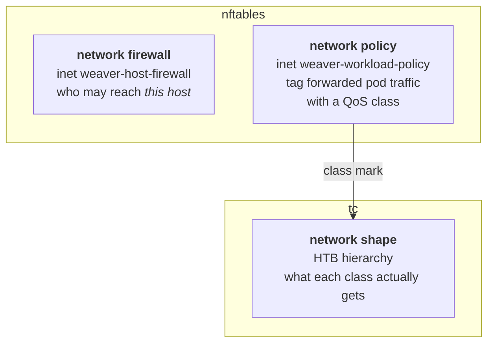

# Network Commands

`solo-provisioner network …` manages the node's network state. There are three scopes, each
with its own guide.

Most operators never run these directly — [`block node install`](../block-node.md#networking-two-independent-switches)
sets all three up. Use them to inspect, adjust, or repair what it created.

## The three planes

| I want to… | Scope | Guide |
|---|---|---|
| Control who can SSH to the host, or block an address outright | `network firewall` | [firewall.md](firewall.md) |
| Decide which QoS class a workload's traffic lands in | `network policy` | [policy.md](policy.md) |
| Decide how much bandwidth each class gets | `network shape` | [shape.md](shape.md) |

## How they relate

- **The firewall is node-agnostic.** It applies to every node type — block, consensus, mirror,
  relay — and governs traffic delivered to the host itself.
- **The policy plane is workload-specific.** It tags *forwarded* pod traffic with a QoS class.
  Today the block node is its only caller.
- **Shaping is what the tag buys you.** A policy's `--stamp <class>` names a class; `network
  shape` decides that class's rate, ceiling and priority. A stamp with no shape does nothing
  useful, and a shape nothing stamps into stays empty.

The firewall and the policy plane are separate nftables tables and are turned on by two
[independent switches](../block-node.md#networking-two-independent-switches) on
`block node install`.

## Where state lives

| Path | Written by |
|---|---|
| `/etc/solo-provisioner/network-weaver-host-firewall.{yaml,nft}` | [`network firewall`](firewall.md) |
| `/etc/solo-provisioner/network-weaver-workload-policy.nft` | [`network policy`](policy.md) |
| `/etc/solo-provisioner/policies/` | [`network policy`](policy.md) — one registry file per policy |
| `/usr/local/sbin/solo-provisioner-bandwidth-shaper.sh` | [`network shape`](shape.md) |

Two systemd units replay this at boot:

| Unit | Replays |
|---|---|
| `solo-provisioner-network-nft.service` | Both nftables tables — shared by the firewall and the policy plane |
| `solo-provisioner-bandwidth-shaper.service` | The egress tc HTB hierarchy |

Ingress shaping is **not** replayed by a boot unit: the pod's veth is ephemeral, so the daemon
re-attaches it per-pod with [`block node tc-attach`](../block-node.md#tc-attach--attach-ingress-shaping-to-a-pod-veth).

## See also

- [Block node commands](../block-node.md) — the switches that create all of this
- [Traffic shaper internals](../../dev/traffic-shaper.md) — design notes, boot units, persistence
- [Troubleshooting](../../troubleshooting.md)
