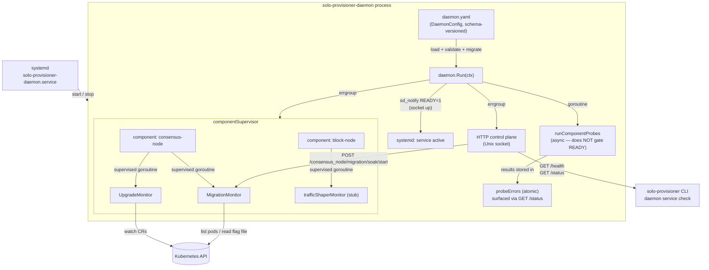
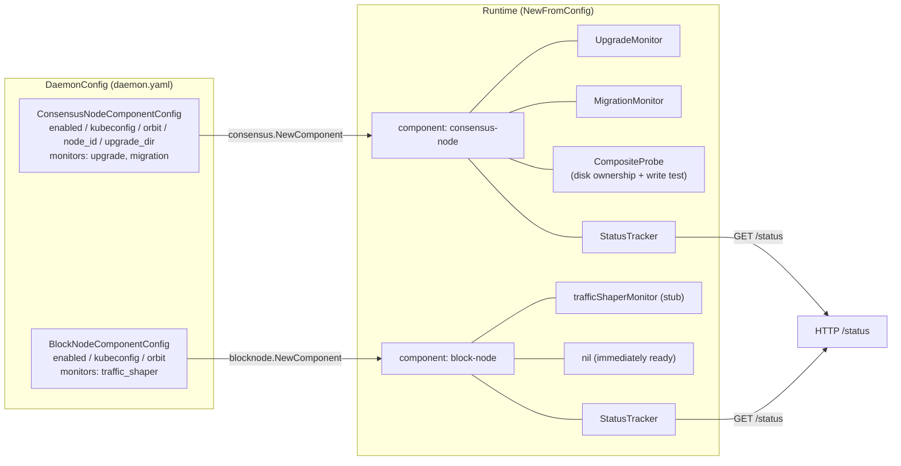
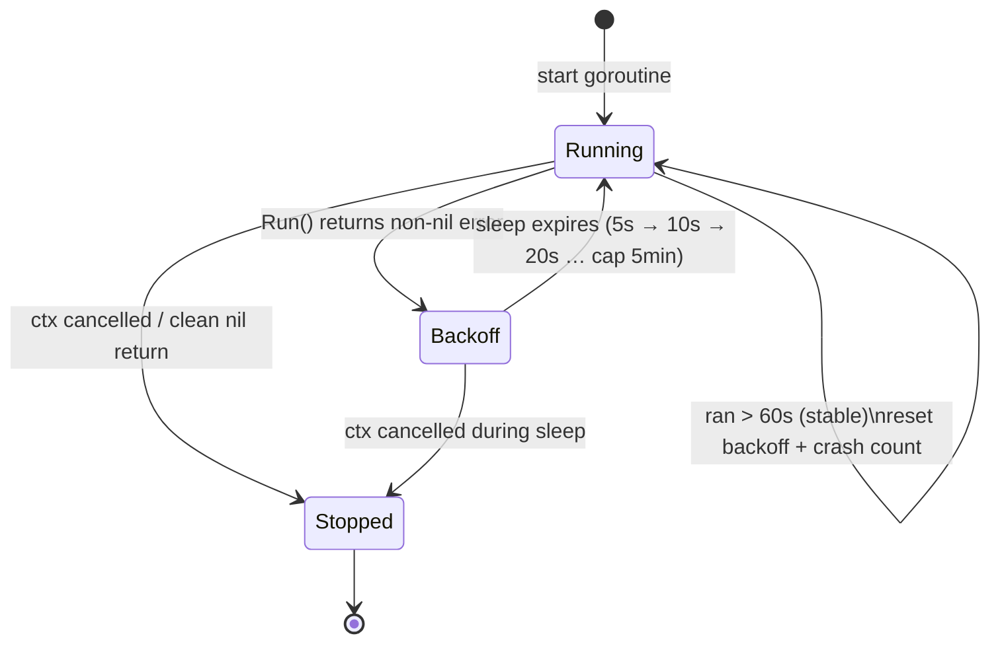
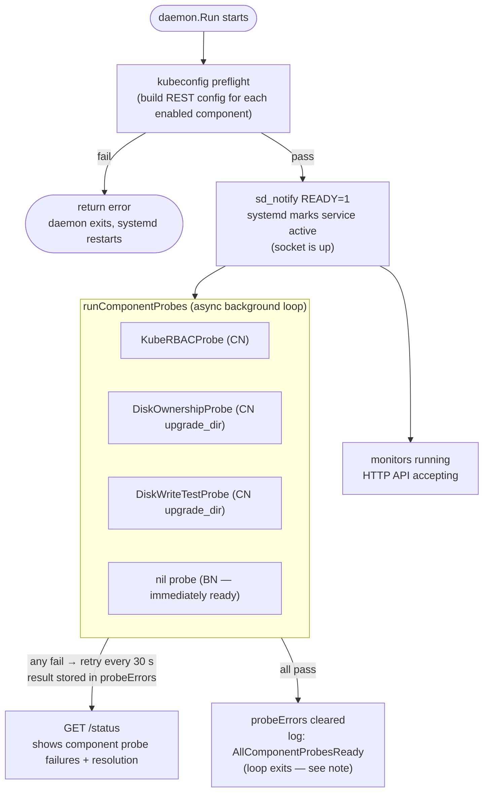
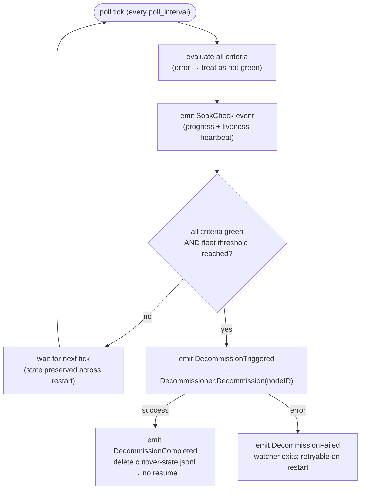
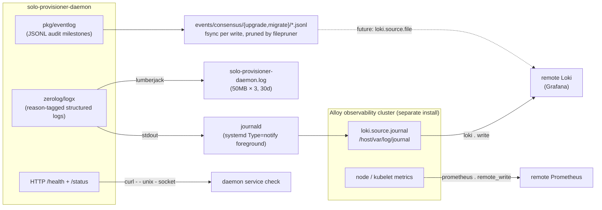
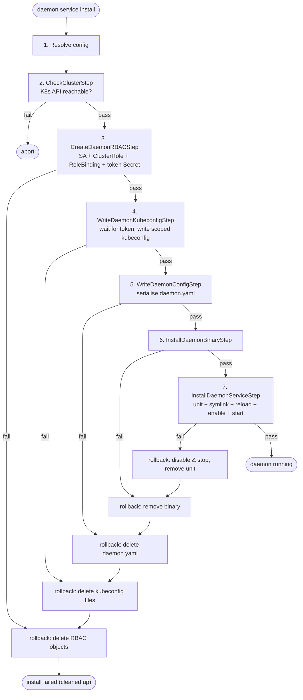

# solo-provisioner-daemon Architecture

> This document is the living architectural reference for the daemon. It is written
> for two audiences: developers extending the daemon, and reviewers assessing it for
> **robustness** and **production readiness**. Where a design
> choice exists to satisfy one of those criteria, the rationale is called out inline.
>
> For operator testing instructions see [daemon-testing-guide.md](daemon-testing-guide.md).

## Vision & Importance

> **One line:** a long-running, self-healing control plane on every node that watches the cluster for
> operator intent and executes upgrades and migration soaks autonomously — without ever taking itself
> down.

### The problem it eliminates

Hedera node upgrades and migrations are high-stakes operations that demand precision and minimal human intervention. A
manual, coordinated approach does not scale to a geographically distributed fleet, cannot survive an unattended
maintenance window, and turns every routine change into an opportunity for human error on a system that secures real
value. A mistimed or partially applied upgrade on a consensus node is not a cosmetic bug — it can corrupt state, break
consensus participation, or leave a node stranded mid-migration.

The daemon replaces that manual ritual with a supervised, observable, and restart-safe automation layer. The node
operator expresses intent; the daemon translates that intent into correct, exactly-once action — and reports
continuously on what it is doing and why.

### Why it matters

- **Unattended correctness on a value-bearing system.** The parts that are catastrophic to get wrong —
  ordering, exactly-once execution, crash/restart recovery, config evolution — are handled by the
  chassis, not by a human at 3 a.m. This is the difference between "automation that saves time" and
  "automation you can trust to run a mainnet node."
- **Fleet-scale operations.** One daemon per node, identical behaviour everywhere, driven declaratively
  from the cluster. Rolling an upgrade across a fleet becomes a cluster-side action, not N SSH sessions.
- **Operability over magic.** Every decision is visible: reason-tagged logs to journald/Loki, an
  fsync'd JSONL audit trail, and a `/status` endpoint that reports not just *what* broke but *how to fix
  it*. Autonomy without observability is a liability; this design refuses that trade.
- **Safety by containment.** Local-only control plane (no open port), per-component scoped credentials,
  and a process that never dies from a single subsystem fault. The blast radius of any one failure is
  deliberately small.

### Strategic role

The daemon is the **node-resident execution arm** of the Solo provisioning model. The CLI
(`solo-provisioner`) is the operator's hands for one-shot setup; the daemon is the always-on autopilot
that keeps a node aligned with operator intent over its lifetime — and the platform on which future
node-level automation (block-node traffic shaping, additional consensus workflows, decommissioning) is
built. It is intentionally a **chassis first**: the supervision, deduplication, crash-safety, config
migration, observability, and install/rollback machinery are complete and proven, so each new
capability slots into a well-isolated, well-specified seam rather than reinventing the hard parts. See
the [Production-Readiness Summary](#production-readiness-summary-review-checklist) for exactly which
payloads are live today versus stubbed for upcoming stories.

## Overview

`solo-provisioner-daemon` is a long-running Linux systemd service that monitors a Hedera network node
for operator-triggered events (consensus-node upgrades, migration soaks) and acts on them autonomously.
It is a **separate binary** from `solo-provisioner` (the CLI) and is installed, managed, and queried
through the CLI's `daemon service` sub-commands.

### Design principles (and why they matter for review)

| Principle                                                  | What it means                                                                                                                                                           | Why it matters                                                                                                                 |
|------------------------------------------------------------|-------------------------------------------------------------------------------------------------------------------------------------------------------------------------|--------------------------------------------------------------------------------------------------------------------------------|
| **Fail-fast startup**                                      | The daemon refuses to start if `daemon.yaml` is missing, malformed, or has an unsupported schema version; each enabled component's kubeconfig must build.               | A misconfigured daemon never half-runs. systemd surfaces the failure immediately instead of the daemon silently doing nothing. |
| **Isolated component credentials**                         | Each component (consensus-node, block-node) carries its own scoped kubeconfig + RBAC, written at install time.                                                          | Blast-radius containment: a compromised or over-broad block-node credential cannot touch consensus-node resources.             |
| **Supervised, never-crashing monitors**                    | Every monitor goroutine is wrapped in `daemonkit.SupervisedMonitor` — crashes are absorbed with exponential back-off; a single monitor failure never takes down the process. | The daemon stays up and serving `/status` even while one subsystem is broken — operators can always introspect.                |
| **Monitors are init-time only**                            | Monitors start once at startup and run until shutdown. The HTTP API triggers *actions within* running monitors, never monitor lifecycle.                                | No dynamic goroutine churn; the goroutine set is fully determined by `daemon.yaml`. Easy to reason about.                      |
| **Local-only control plane**                               | The HTTP API binds a Unix socket (`0660`), never a TCP port.                                                                                                            | No network attack surface; access is gated by filesystem permissions (owner `weaver`, group `weaver`).                         |
| **Durable source of truth lives in the cluster / on disk** | Upgrade idempotency keys off the CR `status.phase`; soak progress is persisted to disk.                                                                                 | The daemon is restart-safe and crash-safe without an embedded database.                                                        |

### System Overview



## Binary & Entry Point

```
cmd/daemon/main.go          # entry point; loads config, applies CLI flag overrides, calls daemon.Run()
```

The daemon binary has its own minimal Cobra root and **does not import any package under `cmd/cli/`**
(an epic-level attack-surface constraint). Logging, config, and proxy bootstrap are re-implemented
self-contained in `cmd/daemon/` rather than shared with the CLI.

There is a second, independent boundary in the other direction: the reusable kernel in `pkg/daemonkit`
imports nothing under `internal/...` or `cmd/...` so it can be shared by a future daemon — see
[daemonkit — reusable daemon foundation](#daemonkit--reusable-daemon-foundation).

### CLI invocation & the import boundary

The no-import rule is a **compile-time** boundary, not a statement that the daemon is fully decoupled
from the CLI. The current design assumption is that, to perform certain provisioning actions whose
logic already lives in the CLI, **the daemon invokes the `solo-provisioner` CLI binary as a
subprocess** rather than re-linking that logic into its own address space. Sharing happens at the
*process* level (exec), not the *package* level (import).

This is a deliberate trade-off:

| Sharing model                   | Avoids                                                                                | Residual risk                                                                                          |
| ------------------------------- | ------------------------------------------------------------------------------------- | ------------------------------------------------------------------------------------------------------ |
| **Invoke CLI binary** (current) | Code duplication; linking the CLI's large dependency tree into the privileged process | Runtime coupling to an external artifact — the CLI binary may be missing, version-skewed, or corrupted |
| Import CLI packages             | The external-binary dependency (everything verified at build time)                    | The entire CLI surface is linked into the privileged daemon process, undermining the small-surface goal |

Optimizing for a **small privileged binary with no duplicated logic** means the daemon accepts
**CLI-binary integrity** as the residual risk. The intended mitigation (not yet implemented) is for
the daemon to **verify the CLI binary before invoking it** — computing its hash (and/or checking the
signature produced by `sign:cli:all`) and comparing it against the expected value so the daemon only
execs a binary it recognises. Exec failures (not found, signature/hash mismatch, non-zero exit,
version skew) should surface through the existing `daemonkit.StatusError` reason/resolution pattern so
`/status` tells the operator exactly what is wrong and how to fix it.

> If we ever decide the external-binary risk is unacceptable, the alternative is to drop the no-import
> rule and have the daemon import the CLI packages directly — accepting the larger linked surface in
> exchange for build-time verification. For now the responsibility and code are intentionally
> segregated.

The import boundary is enforced mechanically by a `depguard` rule (see `.golangci.yml`) that forbids
any `cmd/cli/...` import from `cmd/daemon` and `internal/daemon`, so the promise above cannot be
broken by accident — sharing must go through invocation, not linkage.

Persistent flags: `--config`/`-c`, `--log-level`, `--version`/`-v`, `--output`/`-o`.

Optional override flags (operator-debug / integration-test only; production sets none of these and
everything comes from `daemon.yaml`): `--node-id`, `--kubeconfig`, `--orbit`, `--upgrade-dir`.
Each takes precedence over the corresponding `daemon.yaml` field, and `cfg.Validate()` is re-run
after overrides are applied.

## Package Layout

The package tree is deliberately layered to keep import direction acyclic. The reusable kernel now
lives in **`pkg/daemonkit`** (supervision, the Unix-socket server, sd_notify, the probe framework) and
knows nothing about components or `internal/...`; the daemon-local `probes` package holds only the
K8s-specific leaf probe; component packages (`consensus`, `blocknode`) depend on `daemonkit`; and the
top-level `daemon` package wires everything together. See
[daemonkit — reusable daemon foundation](#daemonkit--reusable-daemon-foundation) for the kernel itself.

```
pkg/daemonkit/                 # Reusable daemon kernel — stdlib + errorx + errgroup only; no internal/... or cmd/... imports
├── monitor.go                 # MonitorRunner, ConnectivityMonitor, StatusTracker, SupervisedMonitor, StatusError, MonitorState
├── probe.go                   # Probe, ComponentProbe, ProbableMonitor, CompositeProbe, BuildComponentProbe
├── tagged.go                  # TaggedProbe + ProbeError (reason/resolution as plain struct fields — no errorx registry)
├── disk.go                    # DiskPermissionProbe, DiskWriteTestProbe, DiskOwnershipProbe
├── component.go               # ComponentHandler interface (RegisterRoutes)
├── server.go                  # Unix-socket HTTP control plane (Server, ServerOptions, ServerConfig) + /health, /status
└── sdnotify.go                # NotifyReady / NotifyStopping (no-op when NOTIFY_SOCKET unset)

internal/daemon/
├── config.go                  # DaemonConfig + typed component configs; Load/Write/Validate; schema-version dispatch
├── config_v1.go               # Sealed v1 on-disk structs + migrateToLatest() chain terminal
├── daemon.go                  # Daemon struct, New/NewFromConfig, Run, componentSupervisor, runComponentProbes, statusSnapshot
├── types.go                   # HealthResponse, StatusResponse, ComponentStatus, ErrorResponse (status payload returned by StatusFn)
├── errors.go                  # errorx types: ErrConfig, ErrConfigNotFound, ErrConfigMalformed
│
├── probes/                    # Daemon-local leaf probe (the only one that needs k8s.io/client-go)
│   └── kube_rbac.go           # KubeRBACProbe — SelfSubjectAccessReview per verb, retries until allowed
│
├── consensus/                 # Consensus-node component
│   ├── component.go           # NewComponent — assembles UpgradeMonitor + MigrationMonitor
│   ├── upgrade_monitor.go     # UpgradeMonitor — watches NetworkUpgradeExecute CRs (list-then-watch)
│   ├── migration_monitor.go   # MigrationMonitor — soak lifecycle, criteria evaluation, crash-safe state
│   ├── criteria.go            # SoakDuration, UploaderBacklogCleared, NoPodRestarts, ConsensusParticipationNominal
│   ├── handler.go             # ConsensusNodeHandler — implements daemonkit.ComponentHandler
│   ├── decommission.go        # Decommissioner interface + NoopDecommissioner
│   ├── types.go               # SoakStartRequest/Response, SoakStatusResponse
│   └── errors.go              # ErrK8sClient, ErrWatchFailed, ErrSoakWatcher
│
└── blocknode/                 # Block-node component
    ├── component.go           # NewComponent — assembles block-node monitors
    └── traffic_shaper_monitor.go  # trafficShaperMonitor stub (blocks on ctx; logs once)
```

### Supporting public packages

```
pkg/eventlog/      # EventLogger — append-only JSONL, fsync-per-write, concurrent-safe; HIP-defined audit records
pkg/filepruner/    # Pruner — strategy-driven retention (age filter + hard-cap) with protected-file safety
```

`pkg/eventlog` is the structured audit trail used by both consensus-node monitors. `pkg/filepruner`
bounds disk usage of the JSONL event directories. Both are reusable and independently unit-tested.

## daemonkit — reusable daemon foundation

`pkg/daemonkit` is the daemon's **reusable kernel**: everything that is "long-running supervised process
on a Linux host" rather than "Hedera consensus-node logic". It was extracted from `internal/daemon/core`
+ `internal/daemon/probes` so a second daemon (e.g. a future solo-operator daemon) can be built on the
same supervision, control-plane, and prerequisite-probe machinery without copying code or dragging in
solo-weaver internals.

### What it provides

| Primitive | Type(s) | Responsibility |
|-----------|---------|----------------|
| **Supervision** | `SupervisedMonitor`, `MonitorRunner` | Runs a monitor in a never-crashing restart loop: exponential back-off (5 s → 2× → 5 min cap), reset after a ≥ 60 s stable run, and a `MonitorDegraded` log every 5th consecutive crash. Absorbs crashes so the process survives indefinitely; clean `nil`/ctx-cancelled return exits without restart. |
| **Status tracking** | `StatusTracker`, `MonitorState`, `StatusError`, `ConnectivityMonitor` | Concurrency-safe per-monitor state (`running` / `degraded` / `backoff:<dur>` / `stopped`). `StatusError` is the operator-facing `{reason, message, resolution, since}` descriptor serialised into `/status`. `ConnectivityMonitor` lets a monitor that is alive-but-retrying surface its live connectivity failure (the supervisor only sees "running"). |
| **Control plane** | `Server`, `ServerOptions`, `ServerConfig`, `ComponentHandler` | Unix-socket HTTP server. Registers process-level `GET /health` and `GET /status` itself; delegates component sub-trees to each `ComponentHandler.RegisterRoutes`. Removes any stale socket, chmods it `0660`, applies a `ReadHeaderTimeout` (default 5 s), and shuts down gracefully (5 s drain) on ctx cancel, removing the socket on exit. `StatusFn func() any` keeps the concrete status payload type in the consuming daemon. |
| **systemd integration** | `NotifyReady`, `NotifyStopping` | `sd_notify` `READY=1` / `STOPPING=1` over `NOTIFY_SOCKET`; a no-op (never an error) when the env var is unset, so manual runs and tests work unchanged. |
| **Probe framework** | `Probe`, `ComponentProbe`, `ProbableMonitor`, `CompositeProbe`, `BuildComponentProbe` | `Probe` is the minimal leaf interface (`Probe(ctx) error`). `CompositeProbe` fans out to N leaf probes concurrently via `errgroup`; the first failure cancels its siblings, and because it satisfies `Probe` itself it nests to arbitrary depth. `BuildComponentProbe` collects `RequiredProbe()` from every `ProbableMonitor` in a component and returns `nil` (= immediately ready) when none declare a prerequisite. |
| **Error tagging** | `TaggedProbe`, `ProbeError` | `TaggedProbe` wraps a leaf probe and, on failure, returns a `*ProbeError` carrying a stable `Reason` code and an actionable `Resolution` hint. |
| **Disk probes** | `DiskPermissionProbe`, `DiskWriteTestProbe`, `DiskOwnershipProbe` | Host-only prerequisite checks: declared mode bits, real process-level writability (create+remove a temp file — exercises ownership/ACL/SELinux), and inode owner UID/GID + minimum mode (via `syscall.Stat_t`, any zero field skipped). |

### Dependency philosophy

The kernel is deliberately **dependency-light** so it stays cheap to vendor and trivial to audit:

- **Org-standard deps only.** It imports nothing beyond the standard library, `github.com/joomcode/errorx`
  (the org error convention), and `golang.org/x/sync/errgroup`. The package doc comment states this
  contract, and it imports nothing under `internal/...` or `cmd/...`.
- **`log/slog` is the logging seam.** The kernel logs through the stdlib `log/slog` facade, never through
  `logx` directly. solo-weaver bridges the two at the binary boundary: `cmd/daemon/main.go` calls
  `slog.SetDefault(slog.New(logx.NewSlogHandler()))` after `logx.Initialize`, so kernel log lines land in
  the same zerolog sinks (console, rotating file, journald) as the rest of the daemon. A different
  consumer can install any other `slog.Handler` and the kernel is none the wiser.
- **`k8s.io/client-go` is deliberately excluded.** The kernel ships disk probes (which need only the
  stdlib) but no Kubernetes probe. Consumers that need RBAC/CRD readiness implement their own leaf probe
  against the `daemonkit.Probe` interface — solo-weaver's `KubeRBACProbe` lives in
  `internal/daemon/probes/kube_rbac.go`, the one daemon-local probe that pulls in client-go. Keeping
  client-go out of the kernel means a daemon with no K8s dependency pays nothing for it.

### The `pkg/models` property-registry boundary

solo-weaver attaches operator-facing remediation to errors using **errorx property singletons**
registered once in `pkg/models` (`ErrPropertyReason`, `ErrPropertyResolution`). Those are process-global
registrations — a reusable kernel must not depend on them, or every consumer would inherit solo-weaver's
registry.

`TaggedProbe` therefore carries `Reason` and `Resolution` as **plain `ProbeError` struct fields**, not
errorx properties. The daemon reads those fields back at its own boundary: `runComponentProbes` does
`errors.As(err, &pe)` on a `*daemonkit.ProbeError` and copies `pe.Reason` / `pe.Resolution` into the
`daemonkit.StatusError` it surfaces via `/status` — no property extraction, no shared registry touched.
Code that wants doctor-layer styling re-wraps into errorx with `pkg/models` keys at the solo-weaver
boundary; the kernel stays registry-free. (The leaf disk probes still build their *underlying* errors
with errorx namespaces — `ExternalError`, `IllegalState` — which is fine: that is plain errorx wrapping,
not property-registry coupling.)

### Planned standalone-module extraction

`daemonkit` is **in-repo first**. The intended end state bundles it with the other two reusable daemon
support packages — `pkg/eventlog` (fsync-per-line JSONL audit trail) and `pkg/filepruner` (strategy-driven
retention) — into a single standalone Go module that a second daemon can import directly.

The split is deferred on purpose: **extract to a separate module only when a second consumer is real.**
Living in-repo keeps the API malleable while solo-weaver is still the only caller (no cross-repo version
churn, no premature stable surface), while the strict import discipline above (stdlib + errorx + errgroup,
slog seam, no client-go, no `internal/...`) keeps the eventual cut a mechanical move rather than a
redesign.

## Configuration (`daemon.yaml`)

Written by `solo-provisioner daemon service install` to `/opt/solo/weaver/config/daemon.yaml`.

```yaml
schema_version: 1
components:
  consensus_node:
    enabled: true
    kubeconfig: /opt/solo/weaver/config/daemon-cn.kubeconfig
    node_id: "0"
    orbit: hedera-network
    upgrade_dir: /opt/hgcapp/services-hedera/HapiApp2.0/data/upgrade/current
    monitors:
      upgrade: true
      migration: true
  block_node:
    enabled: true
    kubeconfig: /opt/solo/weaver/config/daemon-bn.kubeconfig
    orbit: hedera-block-node
    monitors:
      traffic_shaper: true
```

Validation (`DaemonConfig.Validate`): at least one component must be present; an enabled
consensus-node requires `node_id`, `kubeconfig`, and `orbit`. The block-node block currently has no
required fields (the traffic-shaper stub polls a remote API and does not watch K8s).

### Schema versioning — forward-safe config migration

The `schema_version` field future-proofs the on-disk format without ever silently mis-reading an old
or new file:

- `LoadDaemonConfig` uses a **two-phase load**: (1) probe `schema_version` only, (2) unmarshal into the
  matching sealed versioned struct (`daemonConfigV1`, …), then walk a **chained single-step migration**
  via `migrateToLatest()` to produce the current `DaemonConfig`.
- Missing `schema_version` (value `0`) → treated as v1 (backward compatible with pre-versioning files).
- `schema_version` **newer** than `CurrentSchemaVersion` → rejected with an explicit "written by a newer
  binary, upgrade the daemon" error rather than a confusing field-level parse failure.
- Versioned structs in `config_vN.go` are **sealed** — never modified after shipping. Adding a breaking
  change is a mechanical 3-step recipe documented in `config_v1.go`: write `config_v2.go`, add
  `daemonConfigV1.migrate() daemonConfigV2`, bump `CurrentSchemaVersion`.

> **Why reviewers should care**: config evolution is a classic source of production incidents. The
> sealed-struct + single-step-migration pattern makes every format change auditable and reversible,
> and guarantees an old daemon never misinterprets a new file.

## Goroutine Map

```
main.go
└── daemon.Run(ctx)
    ├── errgroup.Go → server.Start(ctx)          # Unix-socket HTTP; fatal on exit (only path that ends the process)
    ├── errgroup.Go → componentSupervisor(ctx)    # never returns non-nil; absorbs all monitor crashes
    │   ├── daemonkit.SupervisedMonitor(ctx, UpgradeMonitor,       tracker)   # one goroutine per monitor
    │   ├── daemonkit.SupervisedMonitor(ctx, MigrationMonitor,     tracker)
    │   └── daemonkit.SupervisedMonitor(ctx, trafficShaperMonitor, tracker)   # stub
    └── go runComponentProbes(ctx)               # async probe loop; results → probeErrors; does NOT gate READY=1
```

The top-level `errgroup` cancels the shared context if **either** `server.Start` or
`componentSupervisor` returns. Because `componentSupervisor` is engineered to never return non-nil,
**only a server crash can bring the process down** — systemd then restarts it via `Restart=always`,
`RestartSec=5s`.

`Run` also installs a top-level `recover()` that logs `DaemonPanic` and `os.Exit(2)` so an
unanticipated panic still results in a clean systemd restart rather than a zombie process.

## Component Model

Each enabled component is built by its package's `NewComponent` factory and represented internally by
the `component` struct in `daemon.go`:

```go
type component struct {
name     string
monitors []daemonkit.MonitorRunner // one supervised goroutine per entry
probe    daemonkit.ComponentProbe // nil = immediately ready (no external deps)
tracker  *daemonkit.StatusTracker    // per-monitor state feeding GET /status
}
```



### Component HTTP routing — extensible by construction

Components that expose endpoints implement `daemonkit.ComponentHandler`:

```go
type ComponentHandler interface {
RegisterRoutes(mux *http.ServeMux)
}
```

`NewFromConfig` collects handlers and passes them to `NewServer` via `ServerOptions.ComponentHandlers`.
Each handler owns its own URL sub-tree (`/consensus_node/…`, `/block_node/…`) and the convention
forbids claiming process-level routes (`/health`, `/status`). New components and monitors add their
own paths **without touching any existing route** — the route namespace is partitioned by design.

Currently only `consensus.ConsensusNodeHandler` registers routes. The block-node stub registers none.

### Adding a new component (the full recipe)

1. Add `FooComponentConfig` + `FooMonitors` to `config.go` **and** the sealed `config_v1.go` (if still
   unreleased) or create `config_v2.go` with a migration step (if v1 has shipped).
2. Create `internal/daemon/foo/component.go` with
   `NewComponent(cfg ComponentConfig) (ComponentResult, error)` following the consensus/blocknode pattern.
3. Implement each `FooMonitor` as a `daemonkit.MonitorRunner`. If it needs prerequisites verified before
   it runs, also implement `daemonkit.ProbableMonitor` and return a `daemonkit.Probe` from
   `RequiredProbe()`. If it should surface live connectivity failures in `/status`, implement
   `daemonkit.ConnectivityMonitor`.
4. If it exposes HTTP endpoints, add `FooHandler` implementing `daemonkit.ComponentHandler` and append it to
   `componentHandlers` in `NewFromConfig`.
5. Wire it into `NewFromConfig` (skip when `!Enabled`; skip individual monitors when their toggle is off).
6. Register the component constant in `internal/ui/prompt/daemon.go` and wire the CLI flag + prompt in
   the install command.

## Resilience: SupervisedMonitor — Back-off & Degradation

`daemonkit.SupervisedMonitor` (in `pkg/daemonkit`) is the heart of the daemon's robustness. It runs a `MonitorRunner` in a
restart loop and absorbs crashes so the process survives indefinitely.

| Parameter           | Default   | Notes                                                             |
|---------------------|-----------|-------------------------------------------------------------------|
| Initial back-off    | 5 s       | Delay before the first restart after a crash                      |
| Back-off multiplier | 2×        | Applied to the *next* crash, not the current one                  |
| Back-off cap        | 5 min     | Maximum delay between restarts                                    |
| Stable threshold    | 60 s      | A run longer than this resets both back-off and the crash counter |
| Degraded threshold  | 5 crashes | Emits a `MonitorDegraded` error log at crash #5, #10, #15, …      |

All thresholds are package-level `var`s (not `const`) in `pkg/daemonkit/monitor.go` so unit tests override them
to run in milliseconds instead of sleeping for real durations — the back-off logic is fully tested
without slow tests.

Return-value contract for `MonitorRunner.Run`:

- `nil` + ctx cancelled → clean shutdown, no restart.
- `nil` without ctx cancellation → treated as a clean exit (logged `MonitorExited`), no restart.
- non-nil error → crash path: log, back off, restart.

### Lifecycle



> **Crash counter**: increments on every restart; emits `MonitorDegraded` every 5th consecutive crash
> so ops keeps getting alerted while a monitor stays broken. Counter and back-off both reset after a
> stable run ≥ 60 s. The back-off value grows *after* the sleep, so the wait sequence for consecutive
> crashes is 5 s → 10 s → 20 s … capped at 5 min.

### Two layers of failure visibility

The supervisor only knows whether a goroutine is *alive*. But a monitor can be alive and retrying
internally (e.g. a K8s watch that keeps failing) — to the supervisor that is still `"running"`.
`daemonkit.ConnectivityMonitor` closes this gap:

```go
type ConnectivityMonitor interface {
MonitorRunner
ConnectivityError() *StatusError // nil when healthy; set on watch/list/auth failure
}
```

`statusSnapshot` overlays `ConnectivityError()` onto the tracker state, so `/status` reports the
monitor as `degraded` with an actionable `StatusError` (reason, message, resolution, since) **even
though the goroutine never crashed**. `UpgradeMonitor` implements this; the `Since` timestamp is
preserved across back-off cycles so it reflects when the outage *started*, not the last retry.

## Component Readiness Probes

Two distinct probe concerns, deliberately separated:

1. **Blocking startup probe** (`daemonkit.ProbableMonitor.RequiredProbe`) — disk prerequisites that must be
   correct before the monitor's automation can possibly succeed. Verified by the async probe loop and
   surfaced in `/status`. Catching these early avoids silent failures mid-automation when human
   intervention is no longer practical.
2. **Self-healing dependencies** (e.g. K8s RBAC / CRD availability) — intentionally **excluded** from
   the blocking probe, because the watch loop already retries them on its own back-off. A CRD that is
   not yet installed at startup resolves itself once installed; it should not be a startup gate.

Leaf probes (`KubeRBACProbe` in `internal/daemon/probes/`; the disk and composite/tagged probes in `pkg/daemonkit`):

| Probe                 | Checks                                                                            | Notes                                                                               |
|-----------------------|-----------------------------------------------------------------------------------|-------------------------------------------------------------------------------------|
| `KubeRBACProbe`       | SA can perform given verbs on a group/resource in a namespace                     | One `SelfSubjectAccessReview` per verb; retries every 2 s until allowed or ctx done |
| `DiskOwnershipProbe`  | Path owner UID/GID + minimum permission bits (via `syscall.Stat_t`)               | Any of User/Group/Permission left zero is skipped                                   |
| `DiskPermissionProbe` | Minimum mode bits on the inode                                                    | Declared permissions, not effective access                                          |
| `DiskWriteTestProbe`  | The *running process* can actually create+remove a file in a dir                  | Exercises ownership, ACLs, mount flags, SELinux/AppArmor implicitly                 |
| `TaggedProbe`         | Wraps any leaf probe; attaches `reason` + `resolution` as `ProbeError` struct fields | Daemon reads the fields back (no errorx registry) to render remediation in `/status` |
| `CompositeProbe`      | Fans out to N leaf probes concurrently (errgroup); first failure cancels siblings | Nestable to arbitrary depth (it satisfies `Probe` itself)                           |

The consensus-node `UpgradeMonitor.RequiredProbe()` composes three tagged disk probes — upgrade-root
ownership (`hedera:hedera 0755`), current-dir ownership (`hedera:hedera 0775`), and a write-test — each
with a precise `sudo …` resolution string an operator can copy-paste.

### Why probes are async (and do not gate systemd startup)

`sd_notify READY=1` is sent the moment the HTTP socket is up and accepting connections. systemd marks
the service `active` immediately, regardless of probe results. Component prerequisite health is tracked
separately in `runComponentProbes` and surfaced via `GET /status`.

This is an intentional production-safety choice: gating `READY=1` on disk prerequisites (e.g. the CN
upgrade staging dir not yet created, or `weaver` not yet in the `hedera` group) would let systemd's
start timeout fire and mark the service `failed` before the operator has a chance to fix it. Instead
the daemon stays `active`, keeps serving `/status`, and `daemon service check` reports exactly what is
wrong and how to fix it.



The probe loop preserves the *first* failure timestamp across retries (`StatusError.Since` reflects the
outage start), and extracts `reason`/`resolution` from the `daemonkit.ProbeError` struct fields attached
by `TaggedProbe` so `/status` is self-explanatory.

> **Known limitation (flagged for reviewers)**: `runComponentProbes` is a **one-shot** loop — once all
> probes pass it returns and does not re-check. The assumption is that RBAC and disk permissions are
> stable after initial setup; if a prerequisite is later revoked, the monitor's own `ConnectivityError`
> / crash path is what surfaces the regression in `/status`, not the probe loop. A future enhancement
> could keep the loop alive at a longer cadence for continuous prerequisite health.

## HTTP Control Plane

The daemon listens on a Unix socket at `/opt/solo/weaver/daemon/daemon.sock` (dir `0750`, socket
`0660`). All endpoints return JSON. The server sets a `ReadHeaderTimeout` (default 5 s) and shuts down
gracefully (5 s drain) on context cancellation, removing the socket file on exit.

Route scheme: `/<component>/<monitor>/<sub-resource>/<verb>` — partitioned so new monitors never
collide with existing paths.

| Method   | Path                                    | Handler                | Description                                                                                                                                                                         |
|----------|-----------------------------------------|------------------------|-------------------------------------------------------------------------------------------------------------------------------------------------------------------------------------|
| `GET`    | `/health`                               | `handlers.go`          | Liveness — always `{"status":"ok"}` while the process is alive                                                                                                                      |
| `GET`    | `/status`                               | `handlers.go`          | Full view: every component, per-monitor state, connectivity errors, and probe failures                                                                                              |
| `GET`    | `/consensus_node/migration/status`      | `consensus/handler.go` | Combined: migration-monitor supervisor health + soak state                                                                                                                          |
| `GET`    | `/consensus_node/migration/soak/status` | `consensus/handler.go` | Soak-run state only (`SoakStatusResponse`)                                                                                                                                          |
| `POST`   | `/consensus_node/migration/soak/start`  | `consensus/handler.go` | Enqueue a soak run. Body capped at 16 KiB, validated. 202 on accept, 409 if already active, 400 on bad body, 503 if monitor disabled                                                |
| `DELETE` | `/consensus_node/migration/soak`        | `consensus/handler.go` | Stop the running soak watcher. `?delete_state=false` preserves `cutover-state.jsonl` so the daemon resumes on next restart (default deletes it). 204 on success, 409 if none active |

> **Extensibility**: future block-node endpoints follow the same pattern, e.g.
> `GET /block_node/traffic_shaper/status`. A planned `GET /consensus_node/migration/monitor/status`
> will expose monitor health independently of soak state.

### Soak stop flow

`DELETE /consensus_node/migration/soak` → `MigrationMonitor.TryStop(deleteState)`:

1. Loads the per-watcher cancel func from `soakCancel` (atomic pointer; nil → no active watcher → 409).
2. Cancels just that watcher's context (not the whole daemon) and waits for drain via `soakWg.Wait()`.
3. Optionally removes `cutover-state.jsonl` (controlled by `delete_state`).

```bash
# Stop soak and delete state (clean stop — daemon will NOT auto-resume)
curl -X DELETE --unix-socket $SOCK http://localhost/consensus_node/migration/soak

# Stop soak but keep state (daemon WILL auto-resume on next restart)
curl -X DELETE --unix-socket $SOCK 'http://localhost/consensus_node/migration/soak?delete_state=false'
```

The socket path is consumed directly by `solo-provisioner daemon service check` via `curl --unix-socket`.

## CLI Commands for Soak Management

Managed via `solo-provisioner consensus migration soak` (not `daemon service` — that tree is scoped to
daemon lifecycle only):

| Command                                                                     | Underlying API      | Notes                                      |
|-----------------------------------------------------------------------------|---------------------|--------------------------------------------|
| `soak start --node-id <id> --cutover-ts <RFC-3339> --migration-plan <path>` | `POST …/soak/start` | All three flags required                   |
| `soak stop [--keep-state]`                                                  | `DELETE …/soak`     | `--keep-state` sends `?delete_state=false` |
| `soak status`                                                               | `GET …/soak/status` | Plain JSON fetch; no TUI workflow          |

`start`/`stop` run through the standard automa workflow + `notify` pipeline (TUI step output
interactively, structured logs in `--non-interactive`), with resolution hints on every error path.

### Reconfigure poll interval without data loss

```bash
sudo solo-provisioner consensus migration soak stop --keep-state   # preserve elapsed soak time
sudo systemctl edit solo-provisioner-daemon.service                # add Environment="SOLO_SOAK_POLL_INTERVAL=30s"
sudo systemctl daemon-reload && sudo systemctl restart solo-provisioner-daemon.service
sudo journalctl -u solo-provisioner-daemon.service -g SoakResumed -n 5   # confirm poll_interval
```

## Consensus-Node Monitors

### UpgradeMonitor (`consensus/upgrade_monitor.go`)

Watches `NetworkUpgradeExecute` CRs (`hedera.com/v1alpha1`) in the orbit namespace and triggers the
execute-phase workflow when a CR reaches `status.phase == ReadyForProvisionerDaemon`.

**List-then-watch (gapless, restart-safe)**: every `Run()` entry calls `listAndSeed` (list all CRs →
seed `completedOpIDs` from terminal-phase CRs → dispatch any already-ready CR that arrived while the
daemon was offline) and then `runWatch` from the List's `ResourceVersion`, so no event is missed
between the snapshot and the stream.

**Self-healing connectivity**: clean watch expiry reconnects after a short delay; real errors retry
with exponential back-off (2 s → 5 min); auth errors (401/403) additionally rebuild the dynamic client
from the kubeconfig on disk before retrying (credential rotation without a restart). The client REST
timeout is 30 s so a TCP-level hang cannot block `Watch()` for the OS TCP timeout (~20 min). A panic in
the watch loop is recovered and converted to a retryable error rather than crashing the daemon.

#### operationId deduplication — exactly-once execution

The same upgrade can be delivered more than once (watch re-delivery, a `listAndSeed` reconnect, or a
restart that re-lists the cluster). Exactly-once execution per `spec.operationId` is enforced by
**three layers**:

| Layer                                 | Mechanism                                                                                                                                   | Window it guards                                                                                                                                                |
|---------------------------------------|---------------------------------------------------------------------------------------------------------------------------------------------|-----------------------------------------------------------------------------------------------------------------------------------------------------------------|
| 1. Terminal phase (upstream, durable) | The CR's own `status.phase` — `listAndSeed` only dispatches `ReadyForProvisionerDaemon`; `Succeeded`/`Failed` are filtered out              | Historical CRs after a restart. **The CR phase is the durable source of truth**, so restart-safety needs no disk persistence.                                   |
| 2. `completedOpIDs` (in-process set)  | Seeded from terminal CRs at each `Run()`; an opID is added only on **successful** completion                                                | The patch round-trip gap — between the execute goroutine finishing and the watch loop observing the CR flip to terminal. Also absorbs same-session re-delivery. |
| 3. `activeOpID` (mutex-guarded slot)  | Single execution slot. Same opID → silently re-acked (`UpgradeMonitorDuplicateEvent`); a *different* opID → rejected (`UpgradeMonitorBusy`) | Concurrent execution while `handleExecute` is in flight.                                                                                                        |

Additional guarantees:

- **Failures stay retryable**: `completedOpIDs` is populated only on `handleExecute` success, so a
  failed op can be re-picked-up by a fresh watch event or reconnect (no automatic in-process requeue).
- **Oldest-first dispatch**: when `listAndSeed` finds multiple pending CRs (orchestrator bug, handled
  defensively) it sorts by creation timestamp so the longest-waiting op wins the single slot.
- **Stuck-phase edge case (documented in code)**: a panic *after* the CR is patched to `InProgress`
  (once the stub is fully implemented) leaves the CR in a phase `listAndSeed` will not re-dispatch;
  recovery requires an external `kubectl patch` back to `ReadyForProvisionerDaemon`.

> `handleExecute` is currently a **stub** — the artefact-staging / infra-upgrade / CR-patch workflow
> lands in subsequent stories. The dedup, supervision, connectivity, and event-log machinery around it
> is complete and tested. The stub documents a hard requirement for implementors: every step must use a
> `context.WithTimeout` so a hung step can never pin `activeOpID` and silently wedge all future upgrades.

Per-operation events are written to `consensus-upgrade-<ts>.jsonl` and the directory is pruned
(`FilenameTimestampStrategy`, maxAge 365 d, keep 50) at every `Run()` entry.

### MigrationMonitor (`consensus/migration_monitor.go`)

Manages the migration **soak** lifecycle: a long-running watcher that polls a set of criteria and, once
all are green and the fleet threshold is reached, triggers node decommission.

- **Criteria** (`criteria.go`, all must pass): `SoakDuration` (48 h default, per HIP), and the stubs
  `UploaderBacklogCleared`, `NoPodRestarts` (real — lists post-cutover pods and tallies container
  restarts), `ConsensusParticipationNominal`. A criterion that *errors* is treated as not-green (a flaky
  check never triggers an irreversible decommission).
- **Single-flight activation**: `TryEnqueue` uses an atomic `soakActive` flag + a 1-capacity channel;
  a duplicate `POST …/soak/start` returns 409. Status is set synchronously on enqueue so a status read
  reflects the accepted request without waiting for the watcher goroutine to spin up.
- **Controlled stop**: `TryStop(deleteState)` cancels just the watcher's context and waits for drain.
- **Crash/restart-safe state**: the activation request is persisted atomically (`.tmp` + rename) to
  `cutover-state.jsonl`. On startup `resumeIfNeeded` reloads it and resumes the watcher — **elapsed soak
  time is preserved** because criteria are evaluated against the persisted `cutover_timestamp`, not
  wall-clock-since-start. Corrupted or invalid state is handled defensively: it is logged as
  `SoakStateCorrupted`, the file is deleted, and the daemon continues rather than crash-looping.
- **Liveness heartbeat**: `SoakCheck` is emitted **every** tick (progress snapshot + goroutine-alive
  signal) — its *absence* in the event log is the failure signal external tooling alerts on.
- **Poll interval resolution**: (1) `MigrationMonitorConfig.PollInterval` (tests), (2)
  `SOLO_SOAK_POLL_INTERVAL` env var (UAT short-poll builds, **must be ≥ 5 s** — a floor that prevents
  hammering the K8s API), (3) 900 s HIP default. `SoakStarted`/`SoakResumed` log lines include
  `poll_interval` so operators can confirm the active value at a glance.
- **Clean teardown**: implements `io.Closer`; `daemon.Run` closes the event logger after the supervisor
  fully stops.

#### Decommission gate



`Decommissioner` is an interface; production currently wires `NoopDecommissioner` (the real
implementation lands in a later story). The whole subsystem is gated behind config and is designed to
be removable once all mainnet nodes are migrated.

## Observability & Remote Monitoring

The daemon emits three independent observability streams, each with a distinct purpose. This separation
is a core production-readiness property: operational debugging, immutable audit, and point-in-time
introspection never compete for the same channel.



### 1. Operational logs (debugging)

`logx` (zerolog-based) emits structured JSON with a stable `reason` field on every line (e.g.
`UpgradeMonitorAuthError`, `MonitorDegraded`, `SoakResumed`). Retries, back-off, auth errors, and other
operational states live here — **not** in the audit log. Logs go to two sinks simultaneously:

- **stdout → journald**: the unit is `Type=notify` and runs in the foreground, so stdout is captured by
  journald under `unit=solo-provisioner-daemon.service`. Query with
  `journalctl -u solo-provisioner-daemon -g <reason>`.
- **Rotated file**: `/opt/solo/weaver/logs/solo-provisioner-daemon.log` via lumberjack
  (50 MB × 3 backups, 30-day retention), created world-readable and group-owned by `weaver`. The CLI and
  daemon deliberately share a config but **never** a log file.

### 2. Structured event audit log (immutable milestones)

`pkg/eventlog` writes append-only JSONL with **fsync on every line**, so audit records survive a daemon
crash. Each `Event` has a fixed, fully-validated schema (`ts`, `level`, `reason`, `msg`, `operationId`,
`nodeId`) — `Log` rejects an event with any zero field. Only `INFO` and `ERROR` levels exist by design:
this is a sparse milestone trail, not a debug stream (operational noise belongs in journald).

The `reason` values for migration events (`SoakStarted`, `SoakResumed`, `SoakCheck`, `CriterionMet`,
`DecommissionTriggered`, …) are **HIP-defined and must not be renamed** — external Alloy pipelines and
Loki alert rules match on their exact spelling. Files:

- `events/consensus/upgrade/consensus-upgrade-<ts>.jsonl` — one file per upgrade operation.
- `events/consensus/migrate/consensus-migrate-events.jsonl` — single append-only soak log.
- `events/consensus/migrate/cutover-state.jsonl` — soak resume state (deleted on clean stop/decommission).

`pkg/filepruner` bounds disk usage: a `Strategy` decides eligibility (e.g. filename-timestamp age), then
a hard-cap keeps at most N files. Files whose eligibility cannot be determined are **protected** —
never deleted by either pass — so a misconfigured strategy can never silently destroy the audit log.

### 3. Point-in-time state (`/health`, `/status`)

`/status` is the operator's single pane of glass: per-monitor supervisor state (`running` / `degraded` /
`backoff:<dur>` / `stopped`), overlaid `ConnectivityError`s, and component `probeErrors` — each with a
machine-readable `reason`, human `message`, copy-pasteable `resolution`, and `since` timestamp. No
journal spelunking required for the common cases.

### Pushing to Loki / Grafana / Prometheus

Remote monitoring is handled by the **separate Alloy observability cluster**, installed independently
via `solo-provisioner alloy cluster install` (see `internal/alloy/` and `internal/templates/files/alloy/`).
Grafana Alloy runs as a DaemonSet/agent and:

- **Logs → Loki**: `loki.source.journal` tails `/host/var/log/journal`, relabels
  `__journal__systemd_unit` → `unit` (plus priority, pid, identifier, …), and forwards via
  `loki.write.<remote>` to one or more remote Loki endpoints. Once Alloy is installed and pointed at a
  remote, the daemon's journald logs are queryable in Grafana with `{unit="solo-provisioner-daemon.service"}`
  — **no extra daemon-side configuration**, because the daemon already logs to journald.
- **Metrics → Prometheus**: node-exporter / kubelet / agent metrics forward via
  `prometheus.remote_write.<remote>` to remote Prometheus-compatible endpoints.
- Remote endpoints (URL, auth, custom relabel rules) come from `models.AlloyConfig`
  (`PrometheusRemotes` / `LokiRemotes`), supporting multiple fan-out targets.

### Gaps & extension points (for reviewers)

- **JSONL events are local-only today.** They are the authoritative audit trail but are *not* yet
  scraped by Alloy. Shipping them is a natural extension: add a `loki.source.file` over
  `events/consensus/**/*.jsonl` with a JSON pipeline stage (the records are already structured with
  stable `reason`/`operationId`/`nodeId` labels). Until then, postmortem analysis reads the files on the
  host directly.
- **No native OpenTelemetry / OTLP exporter.** The daemon does not emit OTLP traces or metrics directly.
  Forwarding to an OpenTelemetry platform is done at the Alloy layer (Alloy supports `otelcol.*`
  components), not in the daemon. Adding in-process OTLP would be a deliberate future decision, not a
  drop-in.
- **Metrics endpoint.** The daemon exposes JSON `/status`, not a Prometheus `/metrics` endpoint; numeric
  monitor/soak metrics are derived downstream from logs/events rather than scraped from the daemon.

## Install / Uninstall Workflow

Triggered by `solo-provisioner daemon service install` (automa workflow with full rollback). Steps run
in order; on any failure the completed steps roll back in reverse:

1. **Resolve config** — `--from-config`, an existing `daemon.yaml`, or flags + interactive prompts.
2. **CheckClusterStep** — verify the K8s API is reachable via the admin kubeconfig.
3. **CreateDaemonRBACStep** — per enabled component, idempotently create SA + ClusterRole +
   ClusterRoleBinding + long-lived token Secret (scoped, independent per component).
4. **WriteDaemonKubeconfigStep** — wait for the SA token Secret, write the scoped kubeconfig
   (`daemon-cn.kubeconfig` / `daemon-bn.kubeconfig`).
5. **WriteDaemonConfigStep** — serialise `DaemonConfig` to `daemon.yaml` (stamps `schema_version`).
6. **InstallDaemonBinaryStep** — download (or verify a local) `solo-provisioner-daemon` binary.
7. **InstallDaemonServiceStep** — write the unit file into the sandbox, symlink it into
   `/usr/lib/systemd/system/`, `daemon-reload`, `enable`, `start`.



Uninstall runs 7→1 in reverse with the same rollback support, and removes `daemon.yaml`.

### systemd hardening

The unit (`internal/templates/files/weaver/solo-provisioner-daemon.service`) runs as `User=weaver`
`Group=weaver`, `Type=notify`, `Restart=always`, `RestartSec=5s`, with `PrivateTmp=true`,
`ProtectSystem=strict`, and `ReadWritePaths=/opt/solo /opt/hgcapp`. `NoNewPrivileges` is intentionally
**omitted** (documented in the unit) because the daemon invokes `sudo solo-provisioner self-upgrade`,
which requires setuid escalation.

## Files on Disk (production paths)

| Path                                                                              | Description                               |
|-----------------------------------------------------------------------------------|-------------------------------------------|
| `/opt/solo/weaver/config/daemon.yaml`                                             | Main config (schema-versioned)            |
| `/opt/solo/weaver/config/daemon-cn.kubeconfig`                                    | Consensus-node scoped kubeconfig          |
| `/opt/solo/weaver/config/daemon-bn.kubeconfig`                                    | Block-node scoped kubeconfig              |
| `/opt/solo/weaver/daemon/daemon.sock`                                             | Unix socket (HTTP control plane, `0660`)  |
| `/opt/solo/weaver/bin/solo-provisioner-daemon`                                    | Daemon binary (symlink target)            |
| `$HOME/sandbox/usr/lib/systemd/system/solo-provisioner-daemon.service`            | Unit file (sandbox)                       |
| `/usr/lib/systemd/system/solo-provisioner-daemon.service`                         | Symlink to the sandbox unit               |
| `/opt/solo/weaver/logs/solo-provisioner-daemon.log`                               | Rotated operational log                   |
| `/opt/solo/weaver/daemon/events/consensus/upgrade/consensus-upgrade-<ts>.jsonl`   | Per-operation upgrade audit log           |
| `/opt/solo/weaver/daemon/events/consensus/migrate/consensus-migrate-events.jsonl` | Append-only soak audit log                |
| `/opt/solo/weaver/daemon/events/consensus/migrate/cutover-state.jsonl`            | Soak resume state (deleted on clean stop) |

## Error Types

`internal/daemon/errors.go` (all `joomcode/errorx`):

| Error type           | When                                                                           |
|----------------------|--------------------------------------------------------------------------------|
| `ErrConfig`          | I/O error reading or writing config                                            |
| `ErrConfigNotFound`  | Config file does not exist (use `daemon.IsConfigNotFound(err)` to distinguish) |
| `ErrConfigMalformed` | YAML parse error, validation failure, or unsupported schema version            |

`consensus/errors.go`: `ErrK8sClient`, `ErrWatchFailed`, `ErrSoakWatcher`. `eventlog`/`filepruner` carry
their own `ErrInvalidEvent` / `ErrPruneFailed`. Errors surfaced to operators carry an
`ErrPropertyResolution` so the doctor layer can render actionable next steps.

## Production-Readiness Summary (review checklist)

| Concern                                 | Status                                     | Where                                                                 |
|-----------------------------------------|--------------------------------------------|-----------------------------------------------------------------------|
| Process never dies on a subsystem fault | ✅                                          | `SupervisedMonitor`, top-level `recover()` + `Restart=always`         |
| Crash-safe / restart-safe state         | ✅                                          | CR `status.phase` (upgrades), atomic `cutover-state.jsonl` (soak)     |
| Exactly-once side effects               | ✅                                          | 3-layer operationId dedup; single-flight soak activation              |
| Fail-fast on bad config                 | ✅                                          | `LoadDaemonConfig` + `Validate` + schema-version guard                |
| Forward-compatible config               | ✅                                          | Sealed versioned structs + single-step migration chain                |
| Self-healing on transient/auth failures | ✅                                          | Watch back-off + client rebuild from kubeconfig                       |
| Operator visibility without log digging | ✅                                          | `/status` with reason/message/resolution/since                        |
| Bounded disk usage                      | ✅                                          | `filepruner` (age + hard-cap, protected files)                        |
| Durable audit trail                     | ✅                                          | `eventlog` fsync-per-write JSONL, HIP-stable reasons                  |
| Remote log/metric shipping              | ✅ (logs/metrics via Alloy→Loki/Prometheus) | `internal/alloy/`, journald scrape                                    |
| Minimal attack surface                  | ✅                                          | Unix socket only; no `cmd/cli` import; scoped per-component RBAC      |
| Bounded blocking I/O                    | ✅                                          | 30 s REST timeout, 5 s read-header timeout, 5 s graceful drain        |
| **JSONL events shipped remotely**       | ⚠️ not yet                                 | Future `loki.source.file` over events dir                             |
| **Continuous prerequisite re-check**    | ⚠️ one-shot                                | `runComponentProbes` exits after first all-pass                       |
| **Native OTLP/OpenTelemetry**           | ⚠️ via Alloy only                          | No in-process OTLP exporter                                           |
| **CLI-binary verification before exec** | ⚠️ not yet                                 | Daemon should hash/verify `solo-provisioner` before invoking it      |
| **`handleExecute` upgrade workflow**    | ⚠️ stub                                    | Lands in subsequent stories (machinery around it complete)            |
| **`Decommissioner`**                    | ⚠️ Noop                                    | Real implementation in a later story                                  |
| **Soak criteria**                       | ⚠️ partial                                 | `SoakDuration` + `NoPodRestarts` real; uploader/participation stubbed |

## Testing

```bash
# Unit tests (macOS — no Linux-only deps in the daemon packages)
go test -race -cover -tags='!integration' ./pkg/daemonkit/... ./internal/daemon/... ./pkg/eventlog/... ./pkg/filepruner/...

# Full suite in the UTM VM
task vm:test:unit
```

Key test files:

- `pkg/daemonkit/monitor_test.go` — `SupervisedMonitor` back-off, degradation, stable-reset (var-override makes
  it fast)
- `pkg/daemonkit/probe_test.go` — composite probe fan-out, first-failure cancellation
- `pkg/daemonkit/server_test.go` — Unix-socket routing + handler status codes; `pkg/daemonkit/sdnotify_test.go` — notify no-op + datagram path
- `internal/daemon/composite_probe_test.go` — component-level probe wiring
- `internal/daemon/server_test.go` — HTTP routing + handler status codes
- `internal/daemon/config_test.go` — load/validate/migrate, schema-version guards
- `internal/daemon/sdnotify_test.go` — notify socket no-op + datagram path
- `internal/daemon/consensus/upgrade_monitor_test.go` — list-then-watch, the 3-layer dedup, auth-error client rebuild
- `internal/daemon/consensus/migration_monitor_test.go` — single-flight, stop/resume, corrupted-state recovery,
  poll-interval floor
- `internal/daemon/consensus/criteria_test.go` — each soak criterion
- `pkg/eventlog/logger_test.go` — fsync append, field validation, path-traversal rejection
- `pkg/filepruner/pruner_test.go` — age filter, hard-cap, protected-file safety
- `internal/workflows/steps/step_daemon_it_test.go` — install/uninstall integration (tag `integration`, needs a cluster)

## Related Documents

- [daemon-testing-guide.md](daemon-testing-guide.md) — step-by-step human tester guide
- [migration-framework.md](../migration-framework.md) — CLI startup migration framework (separate from the daemon)
- [security-model.md](../security-model.md) — RBAC policy rationale
- [effective-value-resolution.md](../effective-value-resolution.md) — flag/config override resolution order
