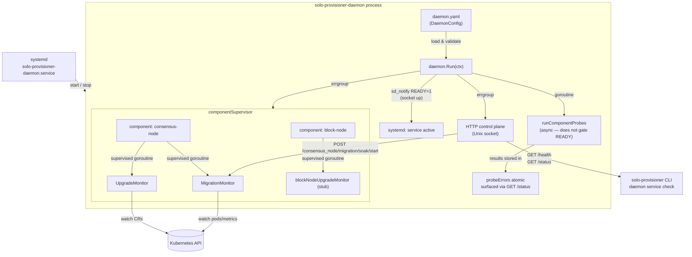
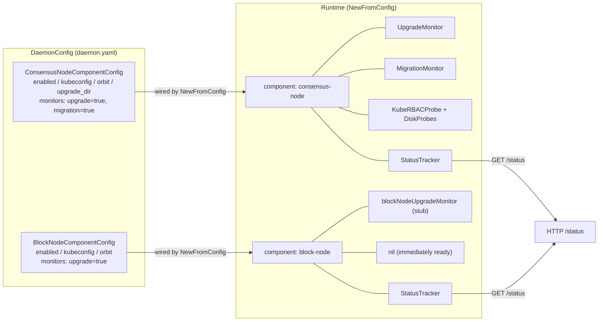
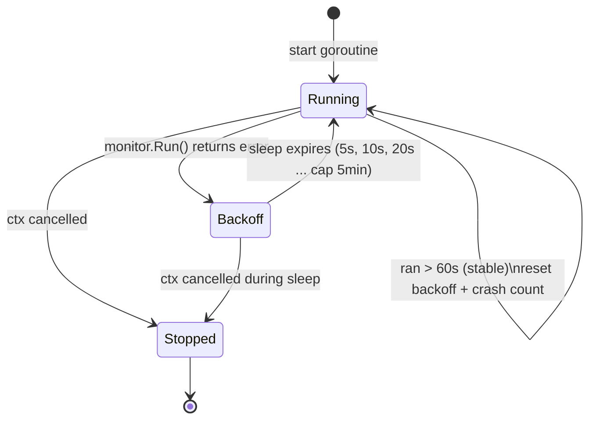
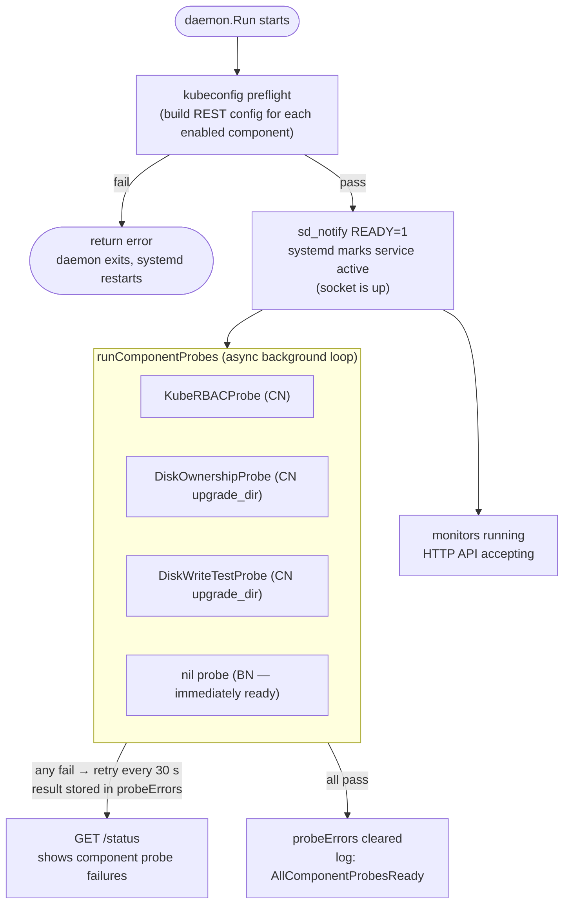
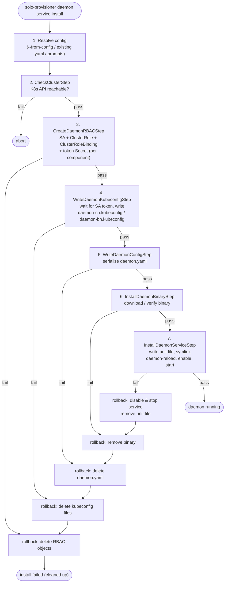

# solo-provisioner-daemon Architecture

> This document is for developers working on or extending the daemon.
> For operator testing instructions see [daemon-testing-guide.md](daemon-testing-guide.md).

## Overview

`solo-provisioner-daemon` is a long-running Linux systemd service that monitors a Hedera network node
for operator-triggered events (upgrades, migrations) and acts on them autonomously.
It is a **separate binary** from `solo-provisioner` (the CLI) and is installed, managed, and
queried through the CLI's `daemon service` sub-commands.

Key design principles:

- **Fail-fast startup**: the daemon refuses to start if `daemon.yaml` is missing, malformed,
  or if any enabled component's kubeconfig is unreachable.
- **Independent component kubeconfigs**: each component (consensus-node, block-node) has its own
  scoped kubeconfig written during install so its RBAC is isolated.
- **Monitors are init-time only**: monitors are started once at daemon startup and run until the
  daemon is stopped. The HTTP API triggers *actions within* running monitors, not monitor lifecycle.
- **Supervised restart**: every monitor goroutine is wrapped in `supervisedMonitor` — crashes are
  absorbed with exponential back-off; the daemon process itself never goes down due to a single
  monitor failure.

### System Overview



## Binary & Entry Point

```
cmd/daemon/main.go          # entry point; loads config, applies CLI flag overrides, calls daemon.Run()
```

Persistent flags: `--config`, `--log-level`, `--version`/`-v`, `--output`/`-o`,
`--node-id`, `--orbit`, `--kubeconfig` (CN overrides applied after config load).

## Package Layout

```
internal/daemon/
├── config.go                  # DaemonConfig, DaemonComponents, typed component configs, Validate/Load/Write
├── config_v1.go               # Sealed v1 versioned structs + migrateToLatest() chain terminal
├── daemon.go                  # Daemon struct, New/NewFromConfig, Run, componentSupervisor
├── component_block_node.go    # blockNodeUpgradeMonitor stub (S7)
├── monitor.go                 # MonitorRunner interface, supervisedMonitor, StatusTracker
├── probe.go                   # ComponentProbe, ProbableMonitor, CompositeProbe
├── server.go                  # Unix-socket HTTP control plane (Server, routes)
├── handlers.go                # HTTP handler implementations
├── errors.go                  # errorx error types (ErrConfig, ErrConfigMalformed, ErrConfigNotFound)
├── types.go                   # HealthResponse, StatusResponse, ComponentStatus, MonitorState
├── sdnotify.go                # sd_notify READY=1 / STOPPING=1 integration
└── consensus/                 # Consensus-node monitor implementations
    ├── upgrade_monitor.go     # UpgradeMonitor — watches NetworkUpgradeExecute CRs
    ├── migration_monitor.go   # MigrationMonitor — soak criteria tracking
    ├── criteria.go            # SoakDuration, UploaderBacklogCleared, NoPodRestarts, ConsensusParticipationNominal
    ├── decommission.go        # Decommissioner interface + NoopDecommissioner
    └── types.go               # Shared types (OperationID, SoakState, etc.)
```

## Configuration (`daemon.yaml`)

Written by `solo-provisioner daemon service install` to `/opt/solo/weaver/config/daemon.yaml`.

```yaml
schema_version: 1
components:
  consensus_node:
    enabled: true
    kubeconfig: /opt/solo/weaver/config/daemon-cn.kubeconfig
    node_id: 0.0.3
    orbit: hedera-network
    upgrade_dir: /opt/hgcapp/services-hedera/HapiApp2.0/data/upgrade/current
    monitors:
      upgrade: true
      migration: true
  block_node:
    enabled: true
    kubeconfig: /opt/solo/weaver/config/daemon-bn.kubeconfig
    orbit: hedera-block-node
    monitors:
      upgrade: true
```

### Schema versioning

The `schema_version` field enables forward-safe config migration:

- `LoadDaemonConfig` probes `schema_version` first, then unmarshals into the matching versioned
  struct (`daemonConfigV1`, ...), then walks a **chained single-step migration** chain via
  `migrateToLatest()` to produce the current `DaemonConfig`.
- A file missing `schema_version` (value `0`) is treated as v1 for backward compatibility.
- A file with `schema_version` newer than `CurrentSchemaVersion` is rejected immediately.
- Versioned structs in `config_vN.go` are **sealed** — never modify after shipping. To add a
  breaking change: write `config_v2.go`, add `daemonConfigV1.migrate() daemonConfigV2`, change
  `migrateToLatest()` to delegate, bump `CurrentSchemaVersion`.

## Goroutine Map

```
main.go
└── daemon.Run(ctx)
    ├── errgroup.Go → server.Start(ctx)         # Unix-socket HTTP, fatal on exit
    ├── errgroup.Go → componentSupervisor(ctx)   # never returns non-nil; absorbs all crashes
    │   ├── supervisedMonitor(ctx, UpgradeMonitor,   tracker)  # per monitor goroutine
    │   ├── supervisedMonitor(ctx, MigrationMonitor, tracker)
    │   └── supervisedMonitor(ctx, blockNodeUpgradeMonitor, tracker)  # stub
    └── go runComponentProbes(ctx)              # async probe loop — results in probeErrors, does NOT gate READY=1
```

The top-level `errgroup` cancels the context if **either** `server.Start` or `componentSupervisor`
returns. Because `componentSupervisor` never returns non-nil, only a server crash will bring down
the daemon process — systemd then restarts it via `Restart=always`.

## Component Model

Each enabled component is represented by the internal `component` struct:

```go
type component struct {
    name     string
    monitors []MonitorRunner   // one goroutine per entry
    probe    ComponentProbe    // nil = immediately ready (no external deps)
    tracker  *StatusTracker    // feeds GET /status
}
```



### Adding a new component

1. Add `FooComponentConfig` + `FooMonitors` to `config.go` and `config_v1.go` (since unreleased)
   or create `config_v2.go` with a migration step (if already released).
2. Add `FooMonitor` in `internal/daemon/component_foo.go` implementing `MonitorRunner`.
   If it needs a kubeconfig probe, also implement `ProbableMonitor`.
3. Wire it in `NewFromConfig` following the consensus-node pattern.
4. Add the component constant in `internal/ui/prompt/daemon.go` (`knownComponents` registry).
5. Wire the CLI flag and prompt step in `install.go` and `prompt/daemon.go`.

## supervisedMonitor — Back-off & Degradation

| Parameter | Default | Notes |
|---|---|---|
| Initial back-off | 5 s | First restart delay after a crash |
| Back-off multiplier | 2x | Doubles on each consecutive crash |
| Back-off cap | 5 min | Maximum delay between restarts |
| Stable threshold | 60 s | Run longer than this resets back-off and crash counter |
| Degraded threshold | 5 crashes | Emits `MonitorDegraded` error log at crash #5, #10, #15, ... |

All parameters are package-level `var`s (not `const`) so unit tests can override them without
sleeping for real durations.

### supervisedMonitor Lifecycle



> **Crash counter**: increments on every restart. Every 5th crash emits a `MonitorDegraded` error
> log. The counter and back-off delay both reset after a stable run lasting more than 60 s.

## Component Readiness Probes

Each component can declare a `ComponentProbe` composed of one or more `Probe` leaf implementations
(e.g. `KubeRBACProbe`, `DiskOwnershipProbe`, `DiskWriteTestProbe`). These probes run **after**
`READY=1` is sent — they do **not** gate systemd startup.

### Why probes are async

`sd_notify READY=1` is sent as soon as the HTTP socket is up and accepting connections. This
means systemd marks the service `active` immediately, regardless of probe results. Component
prerequisite health (kubeconfig RBAC, upgrade-dir ownership, write access) is tracked separately
in `runComponentProbes` and surfaced via `GET /status`. Operators use `solo-provisioner daemon
service check` to inspect it.

This design intentionally avoids a race where missing disk prerequisites (e.g. the CN upgrade
staging directory not yet created) would cause systemd to time out the start and mark the service
`failed` before the operator has a chance to act.



Currently the consensus-node component uses a `KubeRBACProbe` that verifies the SA token can
`list` and `watch` `networkupgradeexecutes` in the orbit namespace. The block-node stub declares
no probe (`nil`) and is treated as immediately ready. If a probe keeps failing, the daemon remains
`active` in systemd but `solo-provisioner daemon service check` will report the failure.

## HTTP Control Plane

The daemon listens on a Unix socket at `/opt/solo/weaver/daemon/daemon.sock`.
All endpoints return JSON.

Route scheme: `/<component>/<monitor>/<sub-resource>/<verb>` — new components and monitors
add their own sub-trees without touching existing paths.

| Method | Path | Description |
|---|---|---|
| `GET` | `/health` | Always returns `{"status":"ok"}` while the process is alive |
| `GET` | `/status` | Full daemon view: all components and their monitor states |
| `GET` | `/consensus_node/migration/status` | Combined view: migration monitor health + soak state (`ConsensusMigrationStatusResponse`) |
| `GET` | `/consensus_node/migration/soak/status` | Soak-run state only (`SoakStatusResponse`) |
| `POST` | `/consensus_node/migration/soak/start` | Enqueue a new soak run (idempotent; 409 if already active) |

> **Extensibility**: future block-node endpoints follow the same pattern:
> `GET /block_node/upgrade/status`, `POST /block_node/upgrade/execute`, etc.
> A planned `GET /consensus_node/migration/monitor/status` will expose monitor
> health independently of soak state.

The socket path is used directly by `solo-provisioner daemon service check` via `curl --unix-socket`.

## Consensus-Node Monitors

### UpgradeMonitor (`consensus/upgrade_monitor.go`)

- Watches `NetworkUpgradeExecute` CRs in the configured `orbit` namespace via the K8s watch API.
- On a new CR event, calls `handleExecute` which runs the upgrade workflow (download artefacts,
  stage to `upgrade_dir`, signal the node).
- Idempotency: a mutex-guarded `activeOpID` rejects a different `operationID` while one is in
  progress; the same `operationID` is silently re-acknowledged.
- Implements `ProbableMonitor` → `KubeRBACProbe` verifies RBAC before startup probe passes.

### MigrationMonitor (`consensus/migration_monitor.go`)

- Evaluates a set of **soak criteria** before signalling that a migration is safe to proceed.
- Criteria (all must pass): `SoakDuration` (48 h default), `UploaderBacklogCleared`,
  `NoPodRestarts`, `ConsensusParticipationNominal`.
- Idempotency: `TryEnqueue()` uses an atomic `soakActive` flag + 1-capacity channel;
  duplicate `POST /consensus_node/migration/soak/start` returns HTTP 409.
- Writes a structured JSONL event log to `paths.DaemonConsensusMigrateEventsDir`.

## Install Workflow

Triggered by `solo-provisioner daemon service install`. Steps run in order:

1. **Resolve config** — `--from-config`, existing `daemon.yaml`, or flags + interactive prompts.
2. **CheckClusterStep** — verify K8s API is reachable via admin kubeconfig.
3. **CreateDaemonRBACStep** — for each enabled component: idempotently create SA,
   ClusterRole, ClusterRoleBinding, and long-lived token Secret.
4. **WriteDaemonKubeconfigStep** — wait for SA token Secret, write scoped kubeconfig
   to `daemon-{cn,bn}.kubeconfig`.
5. **WriteDaemonConfigStep** — serialise `DaemonConfig` to `daemon.yaml`.
6. **InstallDaemonBinaryStep** — download (or verify local) `solo-provisioner-daemon` binary.
7. **InstallDaemonServiceStep** — write unit file to sandbox, symlink to
   `/usr/lib/systemd/system/`, `daemon-reload`, `enable`, `start`.

Uninstall runs steps 7→1 in reverse with full rollback support.



## Files on Disk (production paths)

| Path | Description |
|---|---|
| `/opt/solo/weaver/config/daemon.yaml` | Main config |
| `/opt/solo/weaver/config/daemon-cn.kubeconfig` | Consensus-node scoped kubeconfig |
| `/opt/solo/weaver/config/daemon-bn.kubeconfig` | Block-node scoped kubeconfig |
| `/opt/solo/weaver/daemon/daemon.sock` | Unix socket (HTTP control plane) |
| `/opt/solo/weaver/bin/solo-provisioner-daemon` | Daemon binary (symlink target) |
| `$HOME/sandbox/usr/lib/systemd/system/solo-provisioner-daemon.service` | Unit file (sandbox) |
| `/usr/lib/systemd/system/solo-provisioner-daemon.service` | Symlink to sandbox unit |
| `/opt/solo/weaver/logs/solo-provisioner-daemon.log` | Daemon log |
| `/opt/solo/weaver/events/consensus/upgrade/` | Upgrade event JSONL files |
| `/opt/solo/weaver/events/consensus/migrate/` | Migration soak event JSONL files |

## Error Types (`errors.go`)

All errors use `joomcode/errorx`:

| Error type | When |
|---|---|
| `ErrConfig` | I/O error reading or writing config |
| `ErrConfigNotFound` | Config file does not exist |
| `ErrConfigMalformed` | YAML parse error, validation failure, or unsupported schema version |

Use `daemon.IsConfigNotFound(err)` to distinguish a missing file from a structural problem.

## Testing

```bash
# Unit tests (macOS — no Linux-only deps in daemon package)
go test -race -cover -tags='!integration' ./internal/daemon/...

# Full suite in UTM VM
task vm:test:unit
```

Key test files:
- `internal/daemon/monitor_test.go` — supervisedMonitor back-off and degradation
- `internal/daemon/server_test.go` — HTTP handler coverage
- `internal/daemon/probe_test.go` — composite probe fan-out
- `internal/daemon/consensus/upgrade_monitor_test.go` — UpgradeMonitor watch loop
- `internal/daemon/consensus/migration_monitor_test.go` — soak criteria and idempotency
- `internal/workflows/steps/step_daemon_it_test.go` — install/uninstall integration test
    (tagged `integration`; requires a running K8s cluster)

## Related Documents

- [daemon-testing-guide.md](daemon-testing-guide.md) — step-by-step human tester guide
- [migration-framework.md](migration-framework.md) — CLI startup migration framework (separate from daemon)
- [security-model.md](security-model.md) — RBAC policy rationale
- [effective-value-resolution.md](effective-value-resolution.md) — flag/config override resolution order
