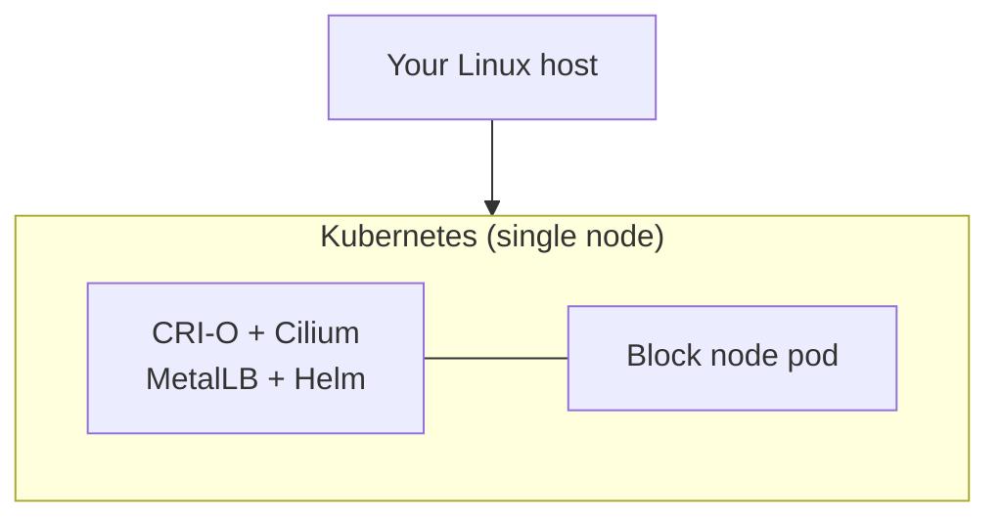

# Quickstart

Solo Weaver is a Kubernetes-native deployment automation platform for Hedera network components. It enables node
operators to migrate from traditional deployment models to modern, containerized infrastructure with automated lifecycle
management.

The binary is called `solo-provisioner`.

Below is a quickstart guide to get you up and running with Solo Weaver. 
Everything else is linked at the [bottom](#where-to-go-next).

## What you will end up with `block node install`



One command — `block node install` — builds all of it.

---

## 1. Prerequisites

- A Unix host. Tested on Debian 13.1.0 and Ubuntu 22.04.
- `curl` installed.
- Root access (`sudo`).

You do **not** need to create any users first:

- `weaver:2500` is created during `solo-provisioner install`.
- `hedera:2000` (which owns node storage) is created the first time you run a `node install`
  command.

## 2. Install the provisioner

```bash
curl -sSL https://raw.githubusercontent.com/hashgraph/solo-weaver/main/install.sh | bash
```

Check it worked:

```bash
solo-provisioner --help
solo-provisioner version
```

## 3. Check the machine

Read-only. Run it before installing anything so you find hardware or connectivity problems
early.

```bash
sudo solo-provisioner block node check --profile=mainnet
```

`--profile` picks the target network — `local`, `perfnet`, `testnet`, `previewnet` or
`mainnet`. It decides the hardware floor and sizing defaults. See
[Deployment profiles](reference/deployment-profiles.md).

## 4. Install the block node

This one command installs the Kubernetes cluster **and** the block node on top of it.

```bash
# Local development
sudo solo-provisioner block node install --profile=local
```

For production you will normally pass a config file and Helm values:

```bash
sudo solo-provisioner block node install \
  --profile=mainnet \
  --config=/etc/solo-provisioner/config.yaml \
  --values=/etc/solo-provisioner/block-node-values.yaml
```

## 5. Verify

```bash
kubectl get pods -n block-node
```

The install also writes a report file. Its path is printed on the `report_path=…` line — keep
it if you need to raise an issue.

---

## Useful flags on day one

| Flag | Why you would use it |
|---|---|
| `--verbose`, `-V` | Show expanded step-by-step output |
| `--log-level=debug` | Turn on debug logs |
| `--non-interactive` | Turn off the TUI and print raw logs. Use this in CI |
| `-o json` | Machine-readable output for automation |
| `--rollback-on-error` | Undo completed steps if a later one fails |

Full list: [Global flags](reference/global-flags.md).

## Optional extras

Each of these is a separate command you can run after the block node is up:

| You want | Run |
|---|---|
| Metrics and logs shipped out | [`alloy cluster install`](commands/alloy.md) |
| Secure SSH / kubectl access | [`teleport … install`](commands/README.md#teleport) |
| A host firewall and traffic shaping | Switches on [`block node install`](commands/block-node.md#networking-two-independent-switches) |

## Changing things later

| Situation | Command |
|---|---|
| New chart version | `block node upgrade` |
| New settings, same version | `block node reconfigure` |
| Empty the storage | `block node reset` |
| Remove the block node | `block node uninstall` |

See [Block node commands](commands/block-node.md) for what each one keeps and what it wipes.

## Uninstalling everything

Tear down workloads first — every teardown command lives inside the binary you remove last.

```bash
sudo solo-provisioner block node uninstall --profile=mainnet
sudo solo-provisioner kube cluster uninstall
sudo solo-provisioner uninstall --yes
```

`--yes` is required; the command refuses to run without it. It irreversibly removes:

- The `solo-provisioner` CLI and its `/usr/local/bin` symlink
- The `solo-provisioner-daemon` binary and its systemd service
- The `solo-provisioner-network-nft` and `solo-provisioner-bandwidth-shaper` boot units
- The configuration tree under `/etc/solo-provisioner` — rendered `.nft` files, the policy
  registry, tc device and class configs

`solo-provisioner uninstall` **fails while a Kubernetes cluster is still provisioned**, so the
middle step is not optional.

> Loaded nft tables and tc qdiscs are left in place. They do not survive a reboot once the
> boot-replay units and their inputs are gone.

---

## Where to go next

| | |
|---|---|
| **[Command reference](commands/README.md)** | Every command, by stack. Includes the quick reference card |
| [Block node](commands/block-node.md) | Install, upgrade, reconfigure, reset, uninstall |
| [Network](commands/network.md) | Host firewall, workload policy, bandwidth shaping |
| [Alloy & secrets](commands/alloy.md) | Metrics, logs, External Secrets Operator |
| **[Workflows](workflows.md)** | End-to-end deploy, upgrade and teardown recipes |
| **[Troubleshooting](troubleshooting.md)** | Common problems and how to get more detail |
| [Global flags](reference/global-flags.md) | Flags that work on every command |
| [Configuration](reference/configuration.md) | Config file, environment variables, proxy |
| [Deployment profiles](reference/deployment-profiles.md) | What `--profile` selects |
