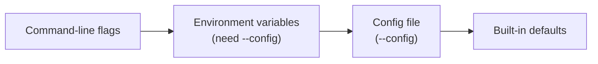

# Configuration

Three ways to configure the provisioner, in the order they win:



1. **Command-line flags** — always win.
2. **Environment variables** — only read when you also pass `--config`.
3. **Config file** — the file named by `--config`.
4. **Built-in defaults** — what you get when nobody said otherwise.

## Config file

Pass a YAML file with `--config`:

```bash
sudo solo-provisioner block node install --profile=mainnet --config=/etc/solo-provisioner/config.yaml
```

```yaml
# config.yaml
log:
  level: debug           # debug, info, warn, error
  consoleLogging: true
  fileLogging: false

blockNode:
  namespace: "block-node"
  release: "block-node"
  chart: "oci://ghcr.io/hiero-ledger/hiero-block-node/block-node-server"
  version: "0.22.1"
  storage:
    basePath: "/mnt/fast-storage"
    archivePath: ""       # optional; defaults to basePath/archive
    livePath: ""          # optional; defaults to basePath/live
    logPath: ""           # optional; defaults to basePath/log
    liveSize: "10Gi"
    archiveSize: "100Gi"
    logSize: "5Gi"

alloy:
  monitorBlockNode: true
  clusterName: "mainnet-block-01"
  prometheusRemotes:
    - name: "primary"
      url: "https://prometheus.example.com/api/v1/write"
      username: "metrics"
      labelProfile: "ops"
  lokiRemotes:
    - name: "primary"
      url: "https://loki.example.com/loki/api/v1/push"
      username: "logs"
      labelProfile: "ops"

teleport:
  version: "16.0.0"
  valuesFile: "/path/to/teleport-values.yaml"
  nodeAgentToken: ""      # leave empty; pass via --token
  nodeAgentProxyAddr: "proxy.teleport.example.com:443"

proxy:
  enabled: false
  url: "127.0.0.1:3128"
  sslCertFile: "/etc/ssl/certs/ca-certificates.crt"
  containerRegistryProxy: "localhost:5050"
```

## Environment variables

Environment variables override config-file values. **They only take effect when you also pass
`--config`** — with no config file, they are ignored.

Format: `SOLO_PROVISIONER_<SECTION>_<FIELD>` — uppercase, underscores between nested fields.

```bash
export SOLO_PROVISIONER_BLOCKNODE_STORAGE_BASEPATH=/data/block-node
export SOLO_PROVISIONER_BLOCKNODE_NAMESPACE=my-block-node

sudo solo-provisioner block node install \
  --profile=mainnet \
  --config=/etc/solo-provisioner/config.yaml
```

## Proxy

Route all outbound traffic through an HTTP/HTTPS proxy. Useful when you want to:

- **Cache downloads** — a local proxy makes repeated deployments much faster.
- **Audit or filter traffic** — send everything through a corporate proxy.
- **Reach a restricted network** — pull from external registries in an air-gapped setup.

```yaml
proxy:
  enabled: true
  url: "127.0.0.1:3128"
  sslCertFile: "/etc/ssl/certs/ca-certificates.crt"
  containerRegistryProxy: "localhost:5050"
```

| Field | What it does |
|---|---|
| `enabled` | Turn proxy mode on |
| `url` | Proxy address as `host:port`. Sets `HTTP_PROXY` and `HTTPS_PROXY` |
| `noProxy` | Hosts/CIDRs to bypass, comma-separated. Defaults to localhost and private networks |
| `sslCertFile` | CA bundle path for TLS verification. Sets `SSL_CERT_FILE` |
| `containerRegistryProxy` | Pull-through image cache as `host:port`. Configures the CRI-O registry mirror |

With the proxy on, the provisioner exports the matching environment variables, so every HTTP
client and every Helm operation goes through it. `sslCertFile` lets you trust a custom CA (for
example, a MITM inspection proxy) without turning TLS verification off.

More detail: [`docs/dev/proxy.md`](../dev/proxy.md).

## Turning on debug logs

Either set it in the config file:

```yaml
log:
  level: debug
  consoleLogging: true
```

or pass the flag, which needs no config file:

```bash
sudo solo-provisioner block node install --profile=local --log-level=debug
```
