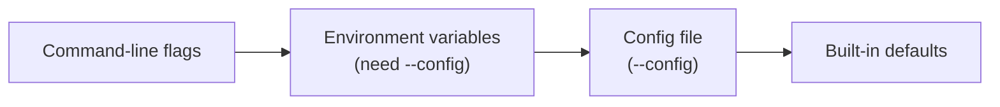

# Configuration

Three ways to configure the provisioner, in the order they win:



1. **Command-line flags** — always win.
2. **Environment variables** — only read when you also pass `--config`.
3. **Config file** — the file named by `--config`.
4. **Built-in defaults** — what you get when nobody said otherwise.

## Config file

Pass a YAML file with `--config`:

```bash
sudo solo-provisioner block node install --profile=mainnet --config=/etc/solo-provisioner/config.yaml
```

```yaml
# config.yaml
log:
  level: debug           # debug, info, warn, error
  consoleLogging: true
  fileLogging: false

blockNode:
  namespace: "block-node"
  release: "block-node"
  chart: "oci://ghcr.io/hiero-ledger/hiero-block-node/block-node-server"
  version: "0.22.1"
  storage:
    basePath: "/mnt/fast-storage"
    archivePath: ""       # optional; defaults to basePath/archive
    livePath: ""          # optional; defaults to basePath/live
    logPath: ""           # optional; defaults to basePath/log
    liveSize: "10Gi"
    archiveSize: "100Gi"
    logSize: "5Gi"

alloy:
  monitorBlockNode: true
  clusterName: "mainnet-block-01"
  environment: ""         # optional; ops "environment" label, defaults to profile
  prometheusRemotes:
    - name: "primary"
      url: "https://prometheus.example.com/api/v1/write"
      username: "metrics"
      labelProfile: "ops"
  lokiRemotes:
    - name: "primary"
      url: "https://loki.example.com/loki/api/v1/push"
      username: "logs"
      labelProfile: "ops"

teleport:
  version: "16.0.0"
  valuesFile: "/path/to/teleport-values.yaml"
  nodeAgentToken: ""      # leave empty; pass via --token
  nodeAgentProxyAddr: "proxy.teleport.example.com:443"

proxy:
  enabled: false
  url: "127.0.0.1:3128"
  sslCertFile: "/etc/ssl/certs/ca-certificates.crt"
  containerRegistryProxy: "localhost:5050"
```

### Re-declaring an installed block node

The provisioner records the running block node's chart, version and storage layout so it
can re-apply them without you re-typing anything. When you pass `--config`, the file wins
over those records — it is a statement of what you want, not a fallback.

**Only the settings your file actually names change.** A file is not a complete
replacement for what is on record: leave a setting out and the running block node keeps
its current value. A file with just a `historicRetention` in it changes the retention
window and nothing else. And with no `--config` at all, nothing is overridden — the
running block node's own values are used throughout.

For the settings the file does name:

| `blockNode` setting | On an installed block node |
|---|---|
| `chart` | the file's value is used on `install` and `upgrade`; `reconfigure` refuses a change |
| `version` | the file's value is used on `install` and `upgrade`; `reconfigure` refuses a change |
| `storage.*` | the file's values are used, field by field |
| `historicRetention`, `recentRetention` | the file's values are used |
| `namespace`, `release`, `chartName` | **ignored** — see below |

The file sits in the middle of the usual order, so two things still beat it: a
command-line flag first, then a `SOLO_PROVISIONER_*` variable. Set a field either of
those ways and the file's value for that one field is ignored.

`install`, `upgrade`, `reconfigure` and `reset` all read the file. `uninstall` does not:
it wipes the data directories and deletes the volumes, and pointing that at a path the
block node never used would destroy whatever does live there and leave the real data
behind. Redefining where the data lives while tearing the node down has no meaning
anyway.

`namespace`, `release` and `chartName` are the running release's identity. Changing them
does not move the block node — it makes Helm address a *different* release and leave the
running one behind — so the file cannot change them once the block node is installed. To
move a block node to a new namespace or release name, uninstall and install again.

A change that the cluster cannot absorb in place is still refused rather than applied. In
particular, changing `storage.basePath` or any individual path under it means the existing
PersistentVolumes have to be deleted and recreated, so `block node reconfigure` stops and
asks for `--purge-storage`:

```
storage paths have changed; PVs/PVCs cannot be updated without clearing existing data
  → re-run with --purge-storage to delete existing PVs/PVCs and recreate them at the new paths
```

`reconfigure` re-applies your values at the chart and version the block node is already
running, and checks neither a version move nor a chart switch for safety. So if your file
names a `version` or a `chart` other than the deployed one, it stops and sends you to
`upgrade`, which does check:

```
block node chart version cannot be changed by a reconfigure: deployed "0.30.0", requested "0.31.0"
  → use 'solo-provisioner block node upgrade' to move to a different chart version, or drop
    blockNode.version from the config file to reconfigure at the deployed version
```

`--force` does not skip these — the answer is a different command, not a flag.

Volume sizes work the same way. Growing a volume means deleting and recreating its
PersistentVolume, which only `--purge-storage` does, so a size change without that flag
is refused rather than reported as a success against a volume that kept its old capacity:

```
block node storage liveSize cannot be changed without --purge-storage: PVs/PVCs are not re-rendered
  → re-run with --purge-storage to delete the existing PVs/PVCs and recreate them at the new
    size, or drop the size from the config file to proceed at the deployed one
```

With no `--config`, nothing changes: the running release's own values keep winning over the
built-in defaults.

## Environment variables

Environment variables override config-file values. **They only take effect when you also pass
`--config`** — with no config file, they are ignored.

Format: `SOLO_PROVISIONER_<SECTION>_<FIELD>` — uppercase, underscores between nested fields.

```bash
export SOLO_PROVISIONER_BLOCKNODE_STORAGE_BASEPATH=/data/block-node
export SOLO_PROVISIONER_BLOCKNODE_NAMESPACE=my-block-node

sudo solo-provisioner block node install \
  --profile=mainnet \
  --config=/etc/solo-provisioner/config.yaml
```

## Proxy

Route all outbound traffic through an HTTP/HTTPS proxy. Useful when you want to:

- **Cache downloads** — a local proxy makes repeated deployments much faster.
- **Audit or filter traffic** — send everything through a corporate proxy.
- **Reach a restricted network** — pull from external registries in an air-gapped setup.

```yaml
proxy:
  enabled: true
  url: "127.0.0.1:3128"
  sslCertFile: "/etc/ssl/certs/ca-certificates.crt"
  containerRegistryProxy: "localhost:5050"
```

| Field | What it does |
|---|---|
| `enabled` | Turn proxy mode on |
| `url` | Proxy address as `host:port`. Sets `HTTP_PROXY` and `HTTPS_PROXY` |
| `noProxy` | Hosts/CIDRs to bypass, comma-separated. Defaults to localhost and private networks |
| `sslCertFile` | CA bundle path for TLS verification. Sets `SSL_CERT_FILE` |
| `containerRegistryProxy` | Pull-through image cache as `host:port`. Configures the CRI-O registry mirror |

With the proxy on, the provisioner exports the matching environment variables, so every HTTP
client and every Helm operation goes through it. `sslCertFile` lets you trust a custom CA (for
example, a MITM inspection proxy) without turning TLS verification off.

More detail: [`docs/dev/proxy.md`](../dev/proxy.md).

## Turning on debug logs

Either set it in the config file:

```yaml
log:
  level: debug
  consoleLogging: true
```

or pass the flag, which needs no config file:

```bash
sudo solo-provisioner block node install --profile=local --log-level=debug
```
