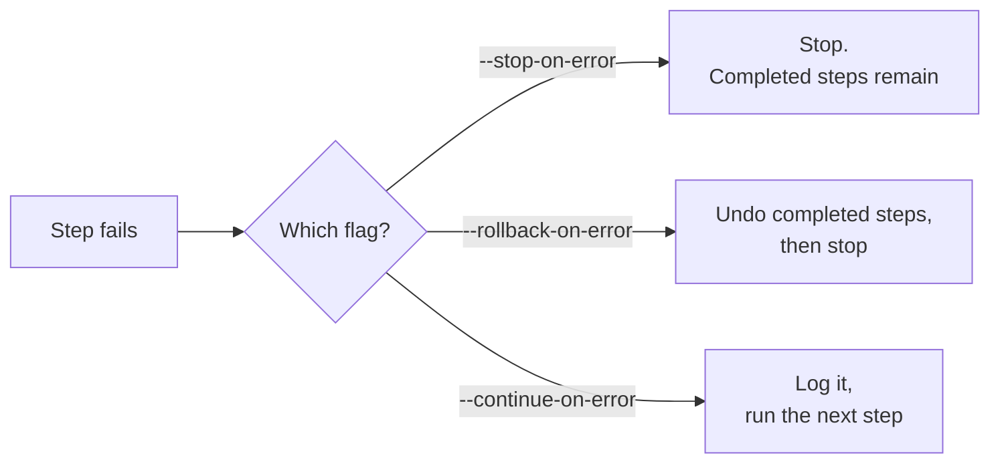

# Global Flags

Flags on this page work on every `solo-provisioner` command.

| Flag | Short | What it does | Default |
|---|---|---|---|
| `--config` | `-c` | Path to config file. See [Configuration](configuration.md). | none |
| `--output` | `-o` | Output format: `text` or `json`. | `text` |
| `--log-level` | — | Log level: `debug`, `info`, `warn`, `error`. | from config file |
| `--force` | `-y` | Force an override, or skip a confirmation prompt. | `false` |
| `--verbose` | `-V` | Show expanded step-by-step output. Repeat for more detail. | off |
| `--non-interactive` | — | Turn off the TUI and print raw log lines. Use this in CI. | `false` |
| `--version` | `-v` | Print the version and exit. | — |
| `--help` | `-h` | Print help for the command you typed it on. | — |

> `--profile` is **not** a global flag. It lives on the command stacks that need it —
> `block node …` and `alloy cluster install`. `kube cluster install` does not take one.
> See [Deployment profiles](deployment-profiles.md).

## Choosing an output format

`--output` picks the **stdout** format. It does not change what the command does.

**`text` (default)** — for a person:

- On a terminal you get the interactive TUI.
- Piped, or with `--non-interactive`, you get plain console log lines.

**`json`** — for automation (Ansible, `jq`, CI):

- **stdout carries data only.** For a workflow command that is the tagged summary
  object; for a one-shot command (`network reassert`) it is a single JSON document.
  A command with its own `--output` (`network firewall show`) is the exception.
- The summary object:
  `{"type":"summary","status":…,"report_path":…,"report":{…}}`
- Select the summary by its tag, not by position:
  ```bash
  solo-provisioner block node install --profile=mainnet -o json | jq 'select(.type=="summary")'
  ```
- **One JSON object per log event (NDJSON) on stderr.** Read progress from there:
  ```bash
  solo-provisioner block node install --profile=mainnet -o json 2>&1 >/dev/null | jq -r .message
  ```
- `-o json` **forces non-interactive mode**. The TUI never renders, matching
  `kubectl -o json` and `terraform -json`.
- Human-facing error panels also go to **stderr**, so the stdout JSON stays clean.

Either way, the workflow report file (`setup_report_<timestamp>.yaml`) is written. Its path
shows up in the `report_path=…` log field and in the JSON summary object.

## Error-handling flags

Workflow commands (`block node …`, `kube cluster …`, `alloy cluster …`) accept one of these.
They are mutually exclusive.

| Flag | On failure | Default |
|---|---|---|
| `--stop-on-error` | Stop at the first failing step. Steps already done stay done. | `true` |
| `--rollback-on-error` | Undo the steps that already succeeded, then stop. | `false` |
| `--continue-on-error` | Log the failure and keep going. | `false` |



> Rollback is not shown in the TUI. To confirm it ran, check `helm list -A` or the
> workflow report YAML named in `report_path=…`.

## Hidden flags

`--skip-hardware-checks` skips hardware validation. It is hidden on purpose: skipping the
checks can leave you with an unstable node or lost data. See [hidden flags](../dev/hidden-flags.md).
