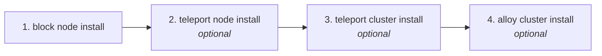

# Workflows

End-to-end recipes. Each one is a sequence of commands documented in full under
[Command reference](commands/README.md).

## Production block node deployment



```bash
# 1. Deploy the block node. This includes preflight checks and the Kubernetes cluster.
sudo solo-provisioner block node install \
  --profile=mainnet \
  --config=/etc/solo-provisioner/config.yaml \
  --values=/etc/solo-provisioner/block-node-values.yaml

# 2. Optional — secure SSH access
sudo solo-provisioner teleport node install \
  --token=$TELEPORT_JOIN_TOKEN \
  --proxy=teleport.hedera.com:443

# 3. Optional — secure kubectl access
sudo solo-provisioner teleport cluster install \
  --values=/etc/solo-provisioner/teleport-kube-values.yaml

# 4. Optional — metrics and logs
sudo solo-provisioner alloy cluster install \
  --monitor-block-node \
  --cluster-name=mainnet-block-01 \
  --add-prometheus-remote=name=primary,url=https://metrics.hedera.internal/write,username=block-metrics \
  --add-loki-remote=name=primary,url=https://loki.hedera.internal/loki/api/v1/push,username=block-logs
```

To also manage the host firewall and traffic shaping, add the switches to step 1 — see
[Networking switches](commands/block-node.md#networking-two-independent-switches).

## Development setup

```bash
sudo solo-provisioner block node install --profile=local

kubectl get pods -n block-node
```

## Upgrade

```bash
# 1. Prepare the new values file.

# 2. Upgrade.
sudo solo-provisioner block node upgrade \
  --profile=mainnet \
  --values=/etc/solo-provisioner/block-node-values-v2.yaml \
  --chart-version=0.24.0

# 3. Verify.
kubectl get pods -n block-node
```

> **Upgrade never turns a feature on or off.** It reads the install decision for the host
> firewall and traffic shaping and re-asserts it. To change what is enabled, use
> [`block node reconfigure`](commands/block-node.md#reconfigure--change-settings-without-changing-the-version).

## Changing settings without changing the version

```bash
# New Helm values on the same chart version
sudo solo-provisioner block node reconfigure \
  --profile=mainnet \
  --values=/etc/solo-provisioner/block-node-values.yaml

# Turn on traffic shaping after the fact
sudo solo-provisioner block node reconfigure \
  --profile=mainnet \
  --traffic-shaping-enabled=true \
  --egress-interface=eth0 \
  --link-rate=1gbit
```

## Clean teardown

Order matters: every teardown command lives in the binary you remove last.

```bash
# 1. Teleport agents, if installed
sudo solo-provisioner teleport cluster uninstall
sudo solo-provisioner teleport node uninstall

# 2. Alloy
sudo solo-provisioner alloy cluster uninstall

# 3. The block node
sudo solo-provisioner block node uninstall --profile=mainnet --purge-storage

# 4. The Kubernetes cluster
sudo solo-provisioner kube cluster uninstall

# 5. The provisioner itself (--yes is required)
sudo solo-provisioner uninstall --yes
```

> `solo-provisioner uninstall` refuses to run while a Kubernetes cluster is still provisioned.
> Step 4 is not optional.

## Copying one firewall allow rule to another host

```bash
# On the source host
sudo solo-provisioner network firewall show --name rudder_server --output commands > rudder.sh

# On the target host
sudo sh rudder.sh
```

The emitted commands are additive, so they are safe to replay on a host that already has a
firewall. See [`--output commands`](commands/network.md#--output-commands-copies-one-rule-to-another-host).
